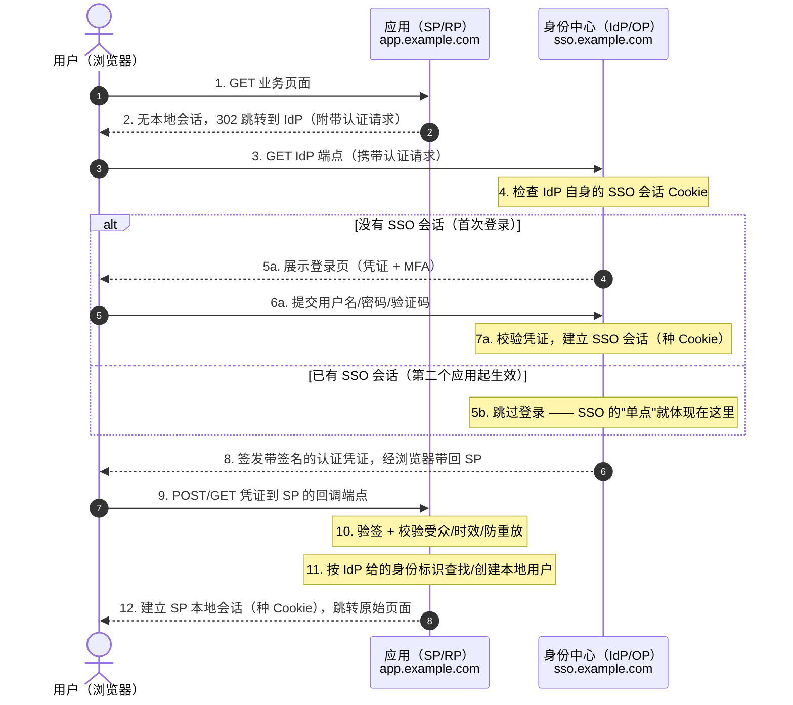
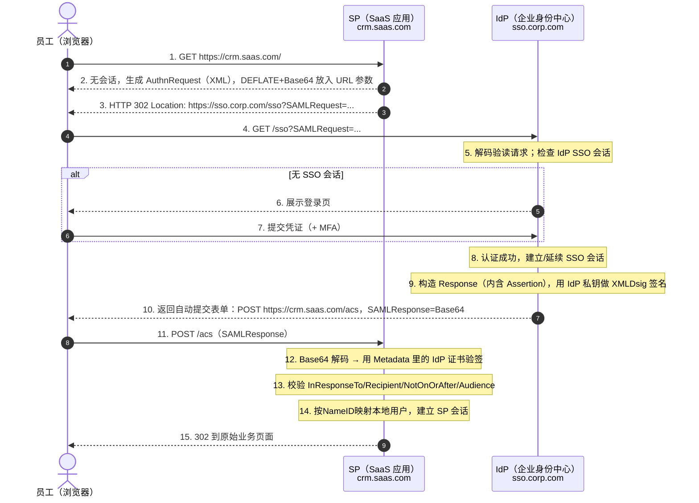
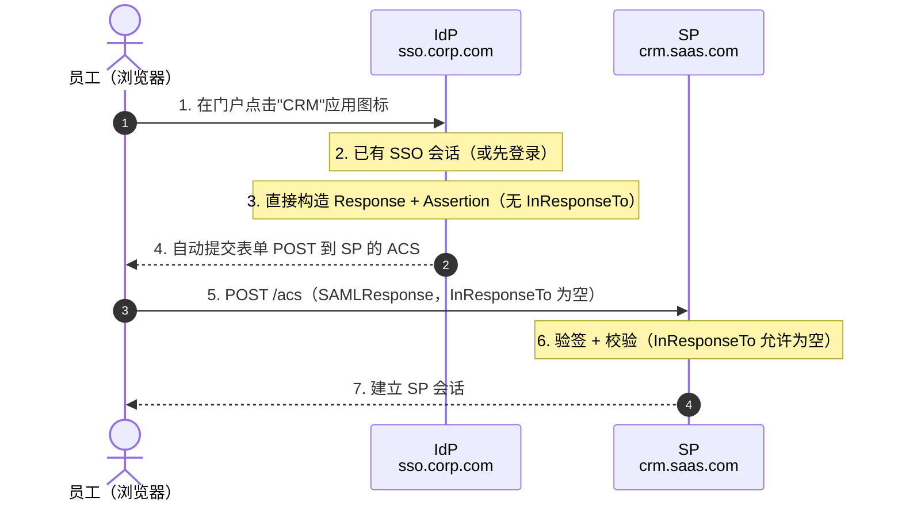
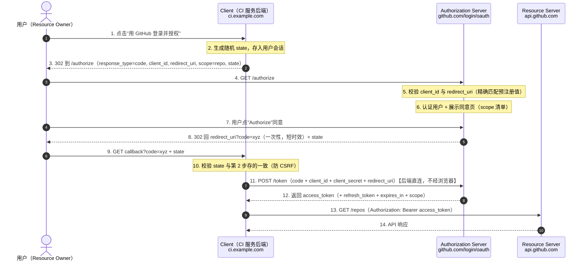
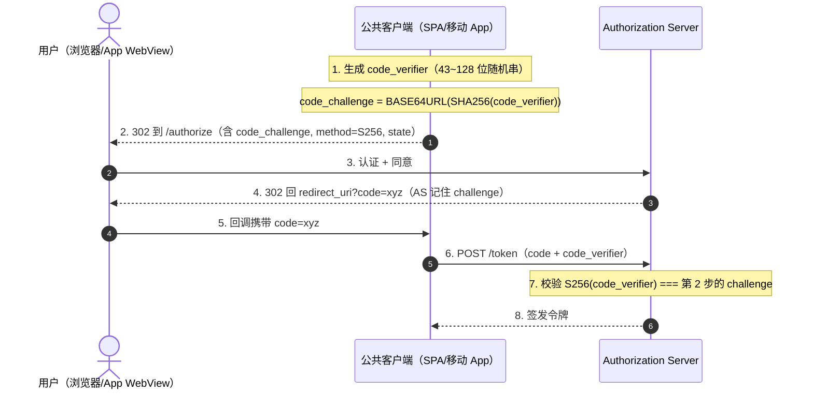
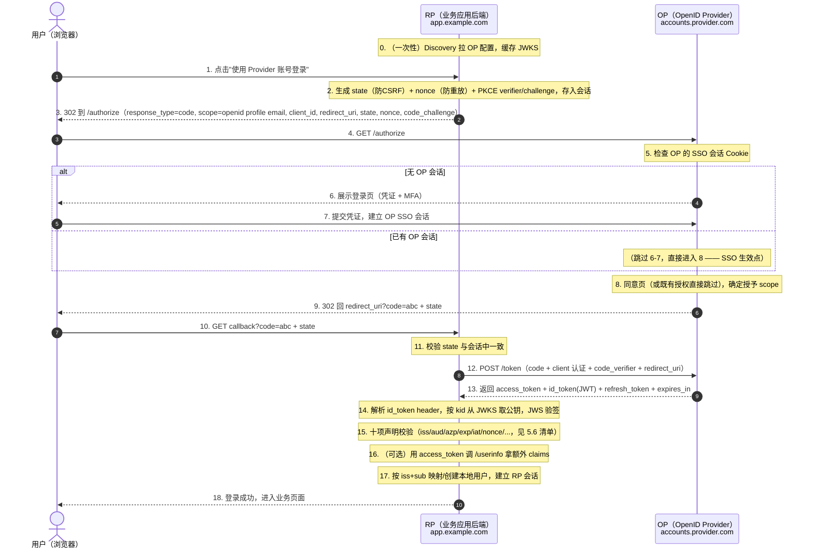
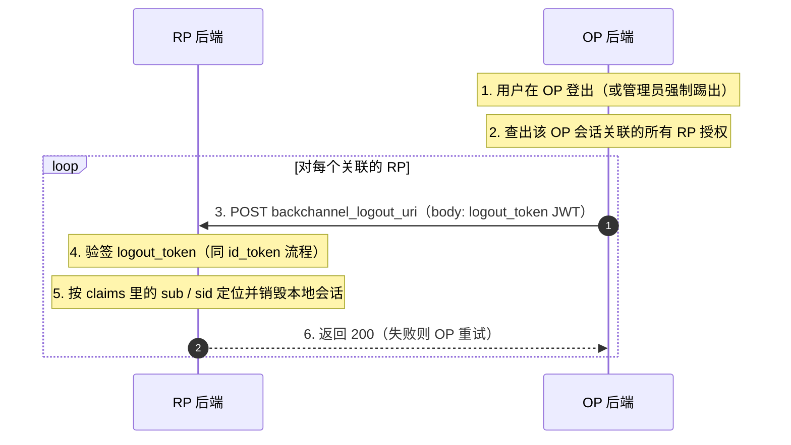

# SSO / SAML / OAuth / OIDC 深度解析（认证与授权协议全景）

> **本文基于的规范**：SAML 2.0（OASIS，2005-03）、OAuth 2.0（RFC 6749 / 6750，2012）、OpenID Connect 1.0（2014-02，含 Discovery / Registration / Session Management / Front-Channel & Back-Channel Logout），并覆盖 RFC 7636（PKCE）、RFC 8628（Device Flow）、RFC 9449（DPoP）、OAuth 2.1（draft）等外围规范。文中所有结论均标注规范出处（RFC 编号 / 规范章节），可据此溯源到官方文本。
>
> **阅读约定**：每章"先问题、后方案、再缺陷"——先用一两段人话讲清"这个协议当年到底要解决什么痛点"，再给出流程图（Mermaid 时序图，带自动编号，GitHub / VS Code / Typora 均可直接渲染）并逐条描述图中每一步的细节，最后专设一节系统性盘点该方案的约束、限制与缺点。安全机制不是附录，而是流程本身的组成部分，会内嵌在流程描述里讲。
>
> **术语对照**：认证（Authentication，你是谁）≠ 授权（Authorization，你能干什么）。这两个词的区别是理解本文全部内容的钥匙，详见 1.2 节。

## 如何读这份文档

推荐两遍读法：

- **第一遍（建立地图，1~2 小时）**：只读第一章（总览）的全部小节、第二章（SSO 通用模型）2.5 节的流程图、以及各章"小结"。目标是能回答：SAML、OAuth、OIDC 各自解决什么问题？三者的关系是什么（谁是谁的子集、谁是谁的地基）？为什么"用 OAuth 登录"在 2014 年之前是个错误的说法？
- **第二遍（深入协议细节）**：按 第三章（SAML）→ 第四章（OAuth 2.0）→ 第五章（OIDC，重点章）的顺序读。每一章的流程图请对照图中自动编号逐条看细节描述——安全机制的精妙之处全部藏在流程的箭头里。第六章是横向对比与选型，可跳读；第七章术语表随用随查。

如果你只有 20 分钟：读 1.2（认证 vs 授权）、1.4（三协议关系图）、5.2（OIDC 核心思想）、6.1（对比总表）、6.3（选型建议）。

---

# 一、总览：三个协议、三个问题、一条演进线

## 1.1 一句话定位

- **SSO（Single Sign-On，单点登录）**：不是协议，是一个**目标**——用户登录一次，就能访问多个相互独立的系统。为达成这个目标，业界造出了两条主要技术路线（联邦认证协议），SAML 和 OIDC 就是这两条路线上的两代代表。
- **SAML 2.0**：**企业级 Web 单点登录的奠基者**。用 XML 断言在 SP（应用）和 IdP（身份源）之间安全传递"认证结果"。2005 年定稿，至今仍是企业 B2B / 传统金融电信存量市场的主力。
- **OAuth 2.0**：**授权委托框架**。让用户在不交出密码的前提下，授权第三方应用访问自己的某类资源（API）。它解决的是"授权"，从规范标题（The OAuth 2.0 Authorization Framework）到设计动机都与"登录"无关。
- **OIDC（OpenID Connect）**：**站在 OAuth 2.0 肩上的身份层**。它在 OAuth 2.0 的授权码流程里加了一个东西——`id_token`（带签名的 JWT），把 OAuth 从"授权框架"补全成"认证 + 授权"的完整协议。今天互联网世界"用 Google/GitHub/微信账号登录"背后跑的几乎都是 OIDC。

一句话串起来：**SAML 和 OIDC 都是解决"联邦认证"（SSO）的，OIDC 建立在 OAuth 2.0 的授权机制之上；OAuth 2.0 本身不解决登录问题。**

## 1.2 问题背景：从"每个系统一套密码"说起

想象 2005 年前后的一家公司：OA、邮箱、CRM、Wiki、报销系统各自建账号。三个视角的痛点：

- **用户视角**：5 个系统 5 套账号密码。人脑的应对是"全部用同一个密码"——密码重用反过来放大了单点沦陷的爆炸半径。这叫**密码疲劳（password fatigue）**。
- **管理员视角**：入职要开 5 个号、离职要关 5 个号，漏关一个就是幽灵账号；密码策略、锁定策略、MFA 策略要在 5 个系统里重复配置，配置漂移不可避免。
- **安全视角**：登录事件散落在 5 个系统里，无法统一审计；没有统一的 MFA 入口；密码明文散布在 5 个数据库里，攻击面 × 5。

于是有了 **SSO 的目标定义**：把"认证"这件事从每个应用里抽出来，集中到一个身份源（IdP）——应用不再自己问"你是谁"，而是问 IdP"这个人是谁、你确定吗"。

要实现这个目标，技术上必须跨过四道坎（第二章展开）：

1. **跨域传递认证结果**：应用和 IdP 几乎必然不同域名，Cookie 不能跨域共享，"认证结果"必须以某种**不可伪造、不可篡改、不可重放**的凭证形式，经浏览器中转送过去；
2. **信任建立**：应用凭什么相信这份"认证结果"真的来自 IdP 而不是攻击者伪造的？→ 需要事先交换密钥/证书；
3. **会话边界**：IdP 的"SSO 会话"和每个应用自己的"本地会话"是两个独立的东西，登录一次 ≠ 永远有效，两边各自超时、各自登出，一致性极难处理；
4. **客户端形态**：浏览器重定向玩得转的东西，移动 App、SPA、命令行、服务间调用未必玩得转。

与此同时，另一个不相干（但常被混为一谈）的问题也在困扰业界：**第三方应用想要用户的资源，用户只能把密码交给它**——早期 Twitter 第三方客户端要用户直接输入 Twitter 密码（所谓 password anti-pattern）。这个问题的正解是 OAuth：用户把"受限的、可撤销的授权"委托给应用，而不是把"身份本身"交出去。

这两类问题——**"你是谁"（认证联邦）**与**"你允许它干什么"（授权委托）**——就是理解全部四个名词的坐标系：

| 名词 | 类别 | 一句话职责 |
|---|---|---|
| SSO | 目标/能力 | 登录一次，处处可用 |
| SAML 2.0 | 认证协议 | 跨域传递"这个人登录了"（XML 断言） |
| OAuth 2.0 | 授权框架 | 跨域委托"允许这个应用代表我调 API"（access token） |
| OIDC | 认证协议（基于 OAuth 2.0） | 在 OAuth 2.0 流程上叠加"这个人登录了"（id_token JWT） |

## 1.3 协议演进时间线

```
1999  Microsoft Passport（商业先驱，单点垄断思路，失败）
2002  SAML 1.0（OASIS）─────────┐
2003  SAML 1.1                  │ XML 路线：企业联邦认证
2005  SAML 2.0（OASIS，至今主流）┘
2005  Liberty Alliance / WS-Federation（微软系并行方案，后边缘化）
2007  OpenID 2.0（去中心化登录，社区驱动，与 OAuth 割裂）
2007  OAuth 1.0（Twitter/Google 发起，解决密码反模式）
2010  OAuth 1.0a → RFC 5849（每请求 HMAC 签名，实现复杂）
2012  OAuth 2.0 → RFC 6749/6750（TLS + Bearer，牺牲安全性换普及）
2014  OpenID Connect 1.0（OAuth 2.0 + 身份层，JSON/JWT）
2015  PKCE → RFC 7636（公共客户端防授权码拦截）
2016+ 配套补丁潮：Introspection(7662)/Metadata(8414)/Device(8628)/JWT-AT(9068)…
2017+ FAPI 1.0（金融级 OIDC 轮廓：PAR/JARM/DPoP/mtLS）
2020+ OAuth 2.1（draft：PKCE 强制、删除 Implicit/Password Grant）
2023+ Back-Channel Logout 普及、OpenID Federation、SIOPv2/HAIP（数字钱包）
```

演进主线有两条：

1. **XML 路线（SAML）→ JSON 路线（OIDC）**：认证联邦的表达方式从重型 XML + XMLDsig 换成轻型 JSON + JWS；
2. **授权与认证的分久必合**：OAuth（授权）与 OpenID（认证）两大阵营在 2014 年合并为 OIDC——OAuth 提供机制（流程、令牌、端点），OIDC 在其上定义身份语义。

## 1.4 三协议关系全景图

```
                 ┌────────────────────────────────────────────────┐
                 │              SSO（目标：登录一次）               │
                 └──────────────────┬─────────────────────────────┘
                                    │ 由联邦认证协议实现
              ┌─────────────────────┴──────────────────────┐
              │                                            │
      ┌───────▼────────┐                        ┌──────────▼───────────────┐
      │    SAML 2.0    │                        │ OpenID Connect (OIDC)    │
      │  （2005, XML）  │                        │  （2014, JSON/JWT）       │
      │  认证联邦协议   │                        │  认证层                   │
      └────────────────┘                        └──────────┬───────────────┘
                                                           │ 建立在其机制之上
                                                ┌──────────▼───────────────┐
                                                │      OAuth 2.0 (2012)    │
                                                │  授权委托框架（不解决登录） │
                                                │  流程/令牌/端点 = OIDC地基 │
                                                └──────────────────────────┘
```

三个关键澄清（都是面试与实际工程里最常踩的坑）：

1. **OAuth 2.0 不是认证协议**。拿到 access token ≠ 知道用户是谁。access token 是给资源服务器（API）用的，第三方应用拿它验证不了任何身份——不同客户端拿到的同一用户的 token 语义、受众都不保证一致。在 OAuth 上自行"解读"access token 当登录凭证，是 2014 年前后的著名反模式（详见 5.1 节"三个坑"）。
2. **OIDC 完全兼容 OAuth 2.0**。一个 OIDC Provider（OP）就是一个 OAuth 2.0 Authorization Server；不带 `scope=openid` 的请求就是普通 OAuth 2.0。所以"既要用 Google 登录，又要授权读 Google Drive"是同一个流程里 scope 的差别，而不是两套协议。
3. **SAML 与 OIDC 是平行的竞争者，不是上下游**。两者都做认证联邦；区别在技术栈（XML vs JSON）、生态（企业存量 vs 互联网原生）、客户端适配（传统 Web vs 全形态）。现代企业 IdP（Okta、Keycloak、Entra ID）通常同时实现两者，做"协议桥接"（见 6.4 节）。

## 1.5 关键问题 → 协议方案映射（全文导览）

| 关键问题 | 协议方案 | 详见 |
|---|---|---|
| 应用不想再自建账号体系，把认证集中到身份源 | IdP/SP 模型 + 联邦认证（SAML 或 OIDC） | 第二章 |
| 跨域传递"登录成功"这一事实且不可伪造 | SAML：XML 断言 + XMLDsig 签名；OIDC：id_token（JWT）+ JWS 签名 | 第三章、第五章 |
| 用户不交密码，让第三方应用访问自己的 API 资源 | OAuth 2.0 授权码流程 + scope 限定 | 第四章 |
| SPA / 移动端（无 client_secret 的公共客户端）安全地跑 OAuth | 授权码流程 + PKCE（RFC 7636） | 4.4 节 |
| 一次登录后，访问第二个应用免密登录 | IdP SSO 会话（IdP 侧 Cookie）+ 协议重定向 | 2.5 节 |
| 应用侧验证"这张令牌真的是 IdP 签的、是发给自己的、没有过期/被重放" | SAML：断言条件 + InResponseTo；OIDC：id_token 十项校验清单 | 3.6、5.6 节 |
| 用户登出时，把所有已登录的应用一起登出 | SAML SLO / OIDC 三种 Logout 规范（至今仍是短板） | 5.8 节 |
| 机器对机器调用，无用户参与 | OAuth 2.0 Client Credentials Grant | 4.5 节 |
| 金融等高风险行业的强安全要求 | FAPI 轮廓（PAR + JARM + DPoP/mtLS + private_key_jwt） | 5.9 节 |

## 1.6 全文章节地图

| 章节 | 内容 | 读者收益 |
|---|---|---|
| 第一章（本章） | 定位、背景、演进线、三协议关系 | 建立全文地图 |
| 第二章 | SSO 问题背景、IdP/SP 模型、通用联邦认证流程、四道安全坎 | 一切的公共地基 |
| 第三章 | SAML 2.0：构件、SP/IdP-Initiated 流程、断言拆解、XML 签名、缺点盘点 | 看懂企业 SSO 存量系统 |
| 第四章 | OAuth 2.0：四角色、授权码流程、PKCE、Grant 类型全景、缺点盘点 | 看懂"授权"的机制本质 |
| 第五章 | OIDC（重点）：id_token 拆解、三大流程、校验清单、会话与登出、缺点盘点 | 看懂现代登录的标准答案 |
| 第六章 | 三协议横向对比、攻击面对照、选型建议、协议桥接 | 做出架构决策 |
| 第七章 | 术语表、规范清单 | 随用随查 |

---

# 二、SSO：问题背景与通用模型

## 2.1 SSO 的两条技术路线

第一章讲了 SSO 的痛点，这一节讲"达成 SSO"在技术上的两条根本不同路线，避免把"SSO"和"SAML/OIDC"画等号：

- **路线 A：同域会话共享（Cookie 域方案）**。所有应用部署在同一个父域下（`a.example.com`、`b.example.com`），认证中心登录后把 Session Cookie 种在 `.example.com` 上，所有应用共享。这是 2000 年前后门户时代的主流（Microsoft Passport 本质也是这个），**只适用于同一个组织控制的同一根域**，跨不了组织边界，今天只在内部小范围使用。优点是简单，缺点是：根域被限定死、Cookie 全局暴露、无法联邦外部身份源。
- **路线 B：跨域联邦认证（Federated Identity）**。应用与身份中心是**不同的域、往往不同的组织**，靠"带签名的凭证 + 浏览器重定向"在域间传递认证结果。SAML、OIDC 都属于这一路线，也是本文的主角。

> 附注：还有第三类"本地 SSO"技术——Kerberos（Windows 域内 AD 的 SSO 底座，票据机制，不走浏览器重定向）和 CAS（Yale 出品的集中式票据协议，Web 重定向 + Service Ticket，逻辑上像简化版 SAML）。它们在各自生态内重要，但协议思想都能映射到本章的通用模型上，不展开。

本文其余部分，**"SSO"均指路线 B 的联邦认证**。

## 2.2 核心抽象：IdP 与 SP/RP

联邦认证的角色模型只有两个实体（外加作为传输通道的浏览器）：

- **IdP（Identity Provider，身份提供者）**：持有用户凭证（密码/MFA/企业目录如 AD/LDAP），执行认证，签发"认证结果凭证"。SAML 里叫 IdP，OIDC 里叫 OP（OpenID Provider），本质相同。
- **SP/RP（Service Provider / Relying Party，服务提供者/依赖方）**：业务应用。它**不做认证**，只"消费"IdP 的认证结果并建立自己的本地会话。SAML 语境叫 SP，OIDC 语境叫 RP，下文统一用 SP 泛指。
- **浏览器**：在 SP 和 IdP 之间搬运凭证的"信使"。这一点极其重要——**协议设计的一切约束都源于"凭证必须能由浏览器这个不可信的载体搬运"**。

关键设计决策：**应用不碰密码**。用户密码只存在于 IdP 一处；应用信任的是 IdP 的**签名**，而不是自己的数据库比对。这就是为什么 SSO 能顺便解决"密码只存一份、MFA 只配一处、审计集中在一处"。

## 2.3 认证与授权：贯穿全文的坐标系

再强调一次坐标系，因为后面每一章都会反复用到：

- **认证（Authentication）**：回答"请求者是谁、你有多确定"。SAML 断言、OIDC id_token 是认证凭证。
- **授权（Authorization）**：回答"这个请求者被允许做什么"。OAuth 的 access token + scope 是授权凭证。

SSO 属于认证问题的范畴（登录一次）；"允许某 App 读取我的文件"属于授权问题的范畴（委托权限）。OAuth 起家于后者；SAML 和 OIDC 本职于前者。

## 2.4 SSO 要解决的四个安全子问题

任何联邦认证协议（SAML、OIDC，甚至 CAS）都必须回答同样四个安全问题。后面三章的协议细节，本质上就是这四个问题的不同答案：

1. **信任建立（怎么认识对方）**：SP 如何获得 IdP 的公钥？——SAML 用带外交换的 XML Metadata（含 X.509 证书）；OIDC 用 Discovery 端点动态拉取 JWKS。**信任根（根证书/受信 issuer）必须是带外人工配置的**，这是防止"攻击者冒充 IdP"的锚点。
2. **凭证防伪造（怎么证明不是我冒充的）**：认证结果必须被 IdP **签名**（XMLDsig 或 JWS），SP 用信任根验签。
3. **凭证防重放（怎么防止截获后重复使用）**：所有协议都给凭证**短有效期**（SAML 断言的 NotOnOrAfter 通常 5 分钟；OIDC id_token 的 exp）；SAML 额外用 `InResponseTo` 把断言和"SP 刚发出的那次请求"一一绑定；OIDC 用 `nonce` 把 id_token 和"RP 刚发起的那次登录"一一绑定。思路完全同构。
4. **凭证防错投（怎么防止发给 A 的凭证被 B 收走）**：SP 校验断言/令牌的**受众**（SAML AudienceRestriction / OIDC aud）必须是自己；同时校验投递目标（SAML Recipient / OAuth redirect_uri）。

## 2.5 联邦认证通用流程（协议无关骨架）

在进入具体协议前，先看一个所有联邦 SSO 共享的骨架流程。**记住这个骨架，后面 SAML 和 OIDC 的流程图都只是它的具体化**：



**逐条细节描述**：

1. **用户访问业务页面**。此时一切正常，用户没有感知。
2. **SP 发现没有本地会话**（Cookie/Session 不存在或过期），**不展示登录页**，而是构造一个"认证请求"（SAML 的 AuthnRequest 或 OIDC 的 /authorize 请求），以 302 重定向把用户浏览器甩给 IdP。请求里通常带：自己是谁（issuer/client_id）、认证完成后回到哪里（ACS URL / redirect_uri）、附加要求（属性、强制重新认证等）。
3. **浏览器跟随重定向访问 IdP**。注意这一步是浏览器的 GET，不是服务器间调用——SP 和 IdP 在协议主路径上不直接通信（有些实现会在后端额外做直连，如 OIDC 的 /token 换码、Back-Channel Logout，见后文）。
4. **IdP 检查自己的 SSO 会话 Cookie**。这个 Cookie 与任何 SP 无关，是 IdP 自己域下（`sso.example.com`）的会话。
5a/5b. **这是"单点"的核心机关**：用户当天第一次登录任何应用时走 5a（输密码）；之后访问第二个、第三个应用时，IdP 一看自己已有 SSO 会话，**直接跳到第 8 步**——用户只感觉到浏览器闪了一下。SSO 的"单次登录"不是魔法，就是 IdP 侧一个域级 Cookie 的存活期。
6a/7a. IdP 认证用户（这里可以插入任意 MFA、风险策略——因为是集中认证，增强认证只改这一处），成功后种 SSO 会话 Cookie。
8. **IdP 生成"认证凭证"**——SAML 是签名的 XML Response/Assertion，OIDC 是先发授权码、后发签名的 id_token（JWT）。凭证内容必然包含：用户标识（NameID / sub）、有效期、受众（发给哪个 SP）、防重放绑定（InResponseTo / nonce）、可能还有属性（邮箱、部门、角色）。签名保证 IdP 之后无法抵赖、他人无法伪造。
9. **浏览器把凭证送回 SP 的回调端点**。SAML 用自动提交的 HTML 表单（POST Binding）；OIDC 用 302 的 query 参数携带授权码（code），再由 SP 后端去换 token。
10. **SP 的验证四件套**（对应 2.4 节的四个安全子问题）：验签 → 校验受众是自己 → 校验时效窗口 → 校验防重放绑定（请求 ID 对得上、凭证没用过）。
11. **本地身份映射**：SP 拿凭证里的用户标识（如邮箱、persistent NameID、sub）在自己用户库里找对应账号，找不到则按策略自动开通（JIT provisioning）或拒绝。联邦协议只回答"这个 IdP 说这个人是谁"，**"这个人能不能用你这个应用"是 SP 自己的授权决策**，不要指望协议替你做。
12. **建立 SP 自己的本地会话**。注意：SP 会话和 IdP SSO 会话是**两个独立的生命周期**——SP 会话 1 小时过期后，SP 会重新走一遍第 2 步，但此时 IdP 会话还活着，用户无感续期；反过来 IdP 会话过期（比如 8 小时）后，任何 SP 的续期都会要求重新输密码。这个双会话模型是理解 SSO 体验和登出难题（5.8 节）的基础。

## 2.6 本章小结

- SSO 是目标，不是协议；实现路径分同域 Cookie 共享与跨域联邦两条，主流是后者。
- 联邦模型只有两个协议实体：持凭证做认证的 IdP，和只消费认证结果的 SP；浏览器是不可信的传输信使。
- 认证 ≠ 授权：SAML/OIDC 本职认证，OAuth 本职授权；OIDC 把两者合到一个流程里。
- 一切协议细节都是四个安全子问题的答案：信任建立、防伪造、防重放、防错投。
- 双会话模型（IdP SSO 会话 + SP 本地会话）既成就了"单点登录"的体验，也埋下了"单点登出"的世纪难题。

---

# 三、SAML 2.0：企业联邦认证的奠基者

## 3.1 诞生背景与解决的问题

SAML（Security Assertion Markup Language）1.0 于 2002 年由 OASIS 发布，2.0 于 2005 年 3 月定稿。它要解决的问题在当年非常具体：**企业开始采购第三方 SaaS（Salesforce 是标志性案例），但 SaaS 不在企业内网，企业员工已有一套 AD/LDAP 账号——如何让员工用企业账号登录企业外的 Web 应用？** 这就是 B2B 联邦认证：企业侧是 IdP（身份源），SaaS 侧是 SP。

当时的技术环境决定了 SAML 的形态：**Web 是唯一客户端（没有 App、没有 SPA）、XML 是数据交换的通用语（SOAP 时代）、企业级安全的本能反应是"数字证书 + 强签名"**。SAML 2.0 于是成为一整套基于 XML 的规范族：核心（Core）、绑定与轮廓（Bindings & Profiles）、元数据（Metadata）、认证上下文（AuthnContexts）等十余份文档。

## 3.2 核心构件

理解 SAML 流程前必须认识四类构件：

1. **断言（Assertion）**：IdP 的核心产品，一份 XML 文档，最多包含三种语句——
   - `AuthnStatement`：**认证语句**（此人在何时、以何种强度、如何被认证的）——SSO 的本体；
   - `AttributeStatement`：**属性语句**（email、部门、角色等用户属性，SP 可直接消费做授权/自动开通）；
   - `AuthzDecisionStatement`：**授权语句**（IdP 对某资源的授权裁决，实践中几乎无人使用）。
2. **绑定（Binding）**：消息如何经过浏览器传输——
   - **HTTP Redirect Binding**：消息压缩（DEFLATE）+ Base64 后放在 URL 查询参数（`SAMLRequest=...`）。只用于传 AuthnRequest（**注意：URL 参数上的签名在 SAML 2.0 中已弃用，Redirect 绑定本身不提供签名保护**，安全依赖后续 Response 的签名）；
   - **HTTP POST Binding**：消息 Base64 后放在 HTML 自动提交表单的隐藏域（`SAMLResponse=...`），签名内嵌在 XML 里。**传 Response 的标准姿势**；
   - **HTTP Artifact Binding**：只传一个短的 Artifact 引用，SP 再通过后端 SOAP 通道取回断言（解决 URL/表单过大的问题，实现少）；
   - SOAP Binding：后端直连场景（Artifact 解析、SLO）。
   - 经典组合因此得名：**Redirect-POST Binding**（请求走 Redirect，响应走 POST）。
3. **元数据（Metadata）**：双方的"名片"XML——实体 ID（EntityID，全局唯一标识）、SSO 端点 URL、支持的绑定、**X.509 签名证书**。信任建立 = 双方管理员互相导入对方 Metadata（带外、人工）。实体 ID 通常形如 `https://idp.example.com/metadata`，它同时是断言里的 Issuer 和 Audience 校验值。
4. **Profile（轮廓）**：构件的组合剧本。本章关注 **Web Browser SSO Profile** 的两种发起方式：SP-Initiated 与 IdP-Initiated；另有 Single Logout Profile（3.7 节吐槽它的实现现状）。

## 3.3 SP-Initiated Web SSO 流程（Redirect-POST Binding，主流程）

这是 SAML SSO 的标准剧本。典型场景：员工打开 `https://crm.saas.com`，被跳到公司 IdP 登录，再被送回 CRM。



**逐条细节描述**：

1. **正常业务请求**。RelayState 机制：若 SP 希望登录后跳回具体深链（如 `/reports/42`），会同时生成一个不透明的 `RelayState` 参数伴随全程，第 15 步据此跳转（RelayState 无签名，SP 必须把它当不透明值用，只允许跳转到预注册的相对路径，否则成为开放重定向漏洞）。
2. **构造 AuthnRequest**。核心字段：`ID="_req123"`（请求唯一标识，**后面防重放全靠它**）、`IssueInstant`、`Issuer`（SP 的 EntityID）、`Destination`（IdP 的 SSO URL）、可选 `NameIDPolicy`（要求 IdP 返回什么格式的用户标识：persistent/transient/email 等）。XML 经 DEFLATE 压缩 + Base64 后拼进 `?SAMLRequest=`。
3. **302 重定向**。这就是 Redirect Binding 的全部——没有签名（SAML 2.0 已弃用 URL 查询参数签名），请求的完整性约束靠第 12~13 步的响应侧校验兜底：恶意篡改过的请求最多导致 IdP 返回一个对不上号的断言，SP 会拒绝。
4. **浏览器到达 IdP**。IdP 解码读出请求，核对 Issuer 是否是已注册的 SP、Destination 是否是自己。
5. **检查 SSO 会话**。IdP 域下的 Cookie 命中与否，决定用户是否要输密码（详见 2.5 节 5a/5b 的说明）。
8. **（无会话时）认证成功**，IdP 建立 SSO 会话；`AuthnStatement` 里的 `AuthnInstant`、`AuthnContextClassRef`（认证强度，如 `PasswordProtectedTransport`）就来自这一步。
9. **构造 Response**。这是 SAML 的灵魂，完整结构在 3.5 节逐行拆解。要点：IdP 可以只签 Assertion，也可以签整个 Response（或两者都签，最稳）；签名用 XMLDsig，规范要求先做 **C14N（XML 规范化）**再算摘要——这个"看似多余"的步骤是后面一整类攻击的温床（3.7 节）。
10. **POST Binding 回传**。IdP 返回一段极简 HTML：`<form method="post" action="SP的ACS URL"><input type="hidden" name="SAMLResponse" value="Base64...">`，外加一行 `document.forms[0].submit()`。签名在 XML 内部，Base64 只是包装，所以 POST Binding 可以承载完整签名。
11. **到达 SP 的 ACS（Assertion Consumer Service）URL**——SP 预先在 Metadata 里注册的接收端点。
12. **验签**。SP 从**自己信任的 Metadata**（而非消息内部）取 IdP 证书验签。**为什么强调"从信任源取证书"：如果 SP 直接使用断言里 `<ds:KeyInfo>` 携带的证书去验签，攻击者就能"自带证书签名自己的断言"——这是真实出现过的实现漏洞**。签名所覆盖的引用必须精确命中根元素（校验 `Reference URI="#AssertionID"` 指向断言本身），否则即是被攻击的信号。
13. **四件套校验**（对应 2.4 节的安全子问题）：
    - `InResponseTo` 必须 === 自己第 2 步发出的 `ID="_req123"`（防重放：断言只能回答一次自己发出的提问；同时要求 SP 侧保存"在途请求 ID"缓存并只允许存在几分钟）；
    - `Recipient` 必须是自己的 ACS URL（防错投）；
    - `NotBefore`/`NotOnOrAfter` 时间窗有效（通常 5 分钟，需容忍几秒时钟偏差；**SAML 对时钟同步敏感**）；
    - `Audience` 包含自己的 EntityID（防止 A 应用收到的断言被投给 B 应用）。
14. **本地身份映射**。`NameID` 是 IdP 选择的用户标识：`persistent`（一个稳定但不暴露真实身份的 GUID，推荐）、`transient`（一次性，最隐私但 SP 无法关联历史账号）、`emailAddress` 等可读格式（方便但泄露且不可变更）。SP 按 NameID 查/建本地账号（JIT provisioning 常配合 AttributeStatement 里的 email/group 属性）。
15. **建立 SP 本地会话，按 RelayState 跳转**。此后 SP 与 IdP 互不相扰，直到 SP 会话过期重演第 1 步。

## 3.4 IdP-Initiated 流程（Unsolicited Response）及其为何不被推荐

另一个剧本：**用户从企业门户/IdP 控制台点击应用图标**发起登录。



细节差异只有一处但性质重大：**断言没有对应的 SP 请求**（`InResponseTo` 为空），所以第 6 步防重放绑定失效，SP 只能靠时间窗 + 单次使用断言 ID 的黑名单兜底。

**为什么它是"不推荐"的流程**：

1. **Login CSRF（登录 CSRF）攻击**：攻击者先用自己的账号从 IdP 拿到一份合法断言（InResponseTo 为空的 Response 是通用的，不绑定某次浏览器会话），然后诱导受害者浏览器提交这份 Response 到 SP——受害者在不知情下登录进了**攻击者的账号**，后续在"自己"账户里的操作（填支付信息、看文档）其实写进了攻击者的账户。
2. 断言是"通用门票"，重放防护全靠 SP 的断言缓存纪律，实现负担更重。
3. 现代 IdP 门户普遍改用"门户点击 → 动态生成一个带一次性 token 的 SP 链接 → 再走标准 SP-Initiated"来模拟这个体验。**生产环境应尽量只开放 SP-Initiated**。

## 3.5 断言结构拆解

一份最小可用的 SAML Response（省略签名细节与命名空间声明，关键点用注释标出）：

```xml
<samlp:Response ID="_resp789"
    InResponseTo="_req123"                    <!-- 必须等于 SP 请求的 ID（防重放锚点） -->
    Destination="https://crm.saas.com/acs"    <!-- 必须是 SP 注册的 ACS URL（防错投） -->
    IssueInstant="2026-10-05T09:30:05Z">
  <saml:Issuer>https://sso.corp.com/metadata</saml:Issuer>
  <samlp:Status><samlp:StatusCode Value=".../status:Success"/></samlp:Status>

  <saml:Assertion ID="_assert42" IssueInstant="2026-10-05T09:30:05Z">
    <saml:Issuer>https://sso.corp.com/metadata</saml:Issuer>
    <ds:Signature>                            <!-- XMLDsig 签名，可覆盖 Assertion 或整个 Response -->
      ...（SignedInfo/C14N 算法、摘要、KeyInfo/证书）...
    </ds:Signature>

    <saml:Subject>
      <saml:NameID Format=".../nameid-format:persistent">_8f3a2b1c</saml:NameID>
      <saml:SubjectConfirmation Method=".../cm:bearer">
        <saml:SubjectConfirmationData
            InResponseTo="_req123"
            NotOnOrAfter="2026-10-05T09:35:05Z"   <!-- 断言寿命，通常 5 分钟 -->
            Recipient="https://crm.saas.com/acs"/>
      </saml:SubjectConfirmation>
    </saml:Subject>

    <saml:Conditions NotBefore="2026-10-05T09:30:05Z"
                      NotOnOrAfter="2026-10-05T09:35:05Z">
      <saml:AudienceRestriction>
        <saml:Audience>https://crm.saas.com/metadata</saml:Audience> <!-- 只发给这个 SP -->
      </saml:AudienceRestriction>
    </saml:Conditions>

    <saml:AuthnStatement AuthnInstant="2026-10-05T09:30:04Z" SessionIndex="_sess1">
      <saml:AuthnContext><saml:AuthnContextClassRef>
        urn:oasis:names:tc:SAML:2.0:ac:classes:PasswordProtectedTransport
      </saml:AuthnContextClassRef></saml:AuthnContext>
    </saml:AuthnStatement>

    <saml:AttributeStatement>
      <saml:Attribute Name="email"><saml:AttributeValue>zhang.san@corp.com</saml:AttributeValue></saml:Attribute>
      <saml:Attribute Name="department"><saml:AttributeValue>研发中心</saml:AttributeValue></saml:Attribute>
    </saml:AttributeStatement>
  </saml:Assertion>
</samlp:Response>
```

逐块读法：

- **Response 层**是信封（状态码、投递信息）；**Assertion 层**是货物（身份主张）。SP 校验时两层都要看：签名覆盖哪一层就验哪一层，**两者都没被签 = 立即拒绝**。
- `SubjectConfirmation Method="bearer"` 表示"持有此断言者即被认证"——Bearer 型凭证的经典表述，也意味着**它被偷了就能用**，所以才有那一堆时间/绑定约束。
- `Conditions` 是"使用条款"：时间窗 + 受众。SP 校验清单里最难写对的就是这里（见 3.7 节 XSW 攻击——攻击的本质就是让 SP 校验了 A 块、签名却覆盖 B 块）。
- `AttributeStatement` 让 SSO 顺带完成属性同步：SP 据此做自动开通、按部门授权。这是 SAML 在企业场景的一个实打实的优点——属性协议成熟度至今仍高于 OIDC 的 claims 实践。

## 3.6 安全机制小结（SAML 是怎么把四道坎答完的）

| 安全子问题（2.4 节） | SAML 的答案 |
|---|---|
| 信任建立 | 带外交换 XML Metadata（含 X.509 证书），人工导入 |
| 防伪造 | XMLDsig 签名（C14N 规范化 + RSA-SHA），SP 从信任的 Metadata 取证书验签 |
| 防重放 | `InResponseTo` 请求绑定 + NotOnOrAfter 5 分钟窗 + 断言 ID 单次消费 |
| 防错投 | `AudienceRestriction` + `Recipient`/`Destination` 校验 |

## 3.7 约束、限制与缺点

SAML 的缺点可以分成"设计基因"和"实现现实"两类：

**A. 协议设计层面的基因缺陷**

1. **只解决认证，不解决 API 授权**。SAML 没有 access token 的概念——应用拿到断言后，若要代表用户调第三方 API，SAML 爱莫能助。这就是 OAuth 存在的理由之一。
2. **不适合浏览器以外的客户端**。流程依赖浏览器重定向 + 自动提交表单：移动原生 App 无法可靠接收一个 POST 表单回调（自定义 URL scheme 收不到表单体）；SPA 也不友好。SAML 2.0 时代没有预见这些形态（ECP 扩展只是补丁，生态几乎没人用）。
3. **消息重**。一个带属性的签名 Response 轻松几 KB 到几十 KB：Redirect 绑定受 URL 长度限制（只能传请求）；POST 绑定表单体积大、移动网络下明显拖慢 SSO。Artifact Binding 是官方补丁但生态稀疏。
4. **XML 技术栈的复杂性税**。C14N 规范化规则极尽琐碎（属性顺序、命名空间、空白、编码都影响摘要结果），任何实现偏差都会导致验签失败——而安全上恰恰相反的方向（校验不严）则导致漏洞。协议把"正确性"押注在实现者对 XMLDsig 的完整理解上，这个赌注事后看是输了（见 B 类第 1 条）。
5. **单点登出（SLO）名存实亡**。SAML 有 Single Logout Profile（IdP 依次向各 SP 发 LogoutRequest），但 SP 侧实现完整率极低（NameID 是 transient 时 SP 甚至无法关联会话），业界现实是"SAML 登出 = 只登出当前 SP，IdP 会话还在，点另一个应用照样进"。
6. **元数据与证书运维**。证书轮换要在每个 SP 的配置里同步更新 IdP 证书（带外人工）；新接入一个 SP，双方交换 Metadata 文件的流程对非安全团队的开发者是纯粹的摩擦。
7. **时钟敏感**。所有防重放都依赖 NotOnOrAfter 时间窗，IdP/SP 服务器时钟漂移会造成间歇性登录失败，是 SAML 运维的经典故障。

**B. 安全实现层面的历史事故（为什么"验签"如此容易写错）**

1. **XML Signature Wrapping（XSW）攻击**：XMLDsig 允许签名元素和被签元素在文档中分离（`Reference URI="#id"` 只锚定"某个 ID"）。攻击者截获合法断言后，把**原断言藏进扩展元素里、再伪造一个新断言顶在明面上**，签名（引用合法断言）依然有效。SP 若实现为"先验签（签的是真断言）→ 再取第一个看起来像断言的元素去读字段（读的是伪造断言）"，攻击即告成功。2011 年起学术界系统化提出（Mainka/Berger 等），2018 年 OneLogin python-saml、2019 年 Duo 对多家商业 IdP 的实测、以及此后持续出现的 CVE，反复证明**同一个漏洞模式能在"验签了"的系统里存活十年**。防御要点：验签后必须确认"被读字段的对象"就是"被验签的对象"（同一节点）、断言唯一、InResponseTo 与签名引用一致——用 2.4 节的话说，四个安全子问题的校验必须作用在**同一个**数据结构上。
2. **KeyInfo 信任错位**（3.3 节第 12 步提过）：信任消息内携带的证书而非本地 Metadata，等于没有信任根。
3. **Redirect Binding 的签名缺失**是规范自身的决定（早期版本支持 URL 签名后来弃用），安全假设完全建立在"响应必签"上，一旦 SP 配置为接受未签 Response 就全线裸奔。

**C. 一句话评价**

> SAML 是"2005 年的工程"：在企业 Web SSO 这个具体问题上它足够好用、生态足够厚（ADFS/PingFederate/Shibboleth/Okta 全支持），以至于今天你仍绕不开它；但它的 XML 负担、浏览器绑定、无授权语义，注定了后来者 OAuth/OIDC 的崛起。**存量市场用 SAML，新建设计默认 OIDC**，是当前业界的普遍共识。

## 3.8 本章小结

- SAML 2.0 用"签名 XML 断言 + 浏览器重定向"回答了联邦认证的全部四个安全子问题；Redirect-POST Binding 是其标准剧本，SP-Initiated 是应开放的主流程。
- 断言的三层校验——签名、Conditions（时间窗 + Audience）、SubjectConfirmation（InResponseTo + Recipient）——缺一不可，且必须作用于同一个节点（XSW 教训）。
- IdP-Initiated 流程存在 Login CSRF 结构性风险，生产环境应关闭。
- SAML 的三大先天短板：无 API 授权语义、非浏览器客户端不友好、XML/签名实现复杂且事故史漫长；SLO 基本名存实亡。
- 它在企业存量市场的地位不可替代，但新系统选型应默认 OIDC。

---

# 四、OAuth 2.0：授权委托框架

## 4.1 诞生背景与解决的问题

OAuth 的起点是一个与 SSO 完全不同的问题：**2006-2007 年，Twitter 的第三方客户端要替用户发推，只能让用户把 Twitter 密码直接交给客户端**（password anti-pattern）。这样做的荒谬之处在于：

- 用户要交出"身份本身"，而实际只想授予"发推"这一个能力；
- 无法限制范围（拿到了就能读私信）、无法只授权一段时间、无法单独撤销（除非改密码，改密码全部应用失效）；
- 密码交给了不可信的第三方。

于是 2007 年诞生 OAuth 1.0（2010 年成为 RFC 5849）：用户跳到服务商页面点"授权"，服务商发一个 access token 给应用，此后应用每次调 API 都用这个 token（加上每请求的 HMAC 签名）。问题解决了，但 **OAuth 1.0 要求应用对每个请求做 HMAC-SHA1 签名（参数排序规范化、双 token 组合），实现门槛极高**，且无法利用 TLS 已提供的传输安全。2012 年的 OAuth 2.0（RFC 6749）做了一个大转向：**传输安全完全交给 TLS，令牌本身不再需要应用侧签名，把复杂度从"每个开发者"转移到"少数 AS/RS 实现者"**——牺牲了一部分安全性，换来了前所未有的普及。

**必须刻在脑子里的定位**：OAuth 2.0 规范标题是 *The OAuth 2.0 Authorization Framework*——它是**授权委托框架**，解决"用户如何在不交出凭证的情况下，授权第三方应用以受限范围（scope）访问自己的资源"。它**不是认证协议**，规范通篇没有任何"向应用证明用户身份"的机制——这个空缺直到 OIDC 才补上（第五章）。

## 4.2 四角色模型与关键澄清

OAuth 2.0（RFC 6749 §1.1）定义四个角色：

- **Resource Owner（资源所有者）**：终端用户，资源（比如你的 GitHub 仓库）的归属者；
- **Client（客户端）**：第三方应用，想要代表用户访问资源；
- **Authorization Server（AS，授权服务器）**：认证用户、征求同意、签发令牌；
- **Resource Server（RS，资源服务器）**：托管资源，校验令牌后提供 API（AS 与 RS 常由同一厂商运营，但逻辑上分离）。

与 SSO 模型（2.2 节）对照可以发现角色错位：SAML 里应用（SP）拿到的是"认证结果"；OAuth 里应用（Client）拿到的是"访问凭证"，**"用户是谁"这个问题 OAuth 根本不回答**。

两个对工程实践影响巨大的补充概念：

- **公共客户端 vs 机密客户端**（RFC 6749 §2.1）：机密客户端（传统后端 Web 应用）能安全保存 `client_secret`；公共客户端（SPA、移动 App、桌面应用）的"secret"打包在用户可触碰的设备里，**视为公开**。这个区分决定了后面 PKCE 的必要性。
- **Bearer 令牌（RFC 6750）**：OAuth 2.0 默认的令牌形态——"谁持有谁就能用"，请求头 `Authorization: Bearer <token>` 即可。方便的代价：令牌一旦泄露，任何持有者都能冒用（4.7 节）。

## 4.3 授权码流程（Authorization Code Grant，主流程）

授权码流程是 OAuth 2.0 的王牌 grant（RFC 6749 §4.1），设计上巧妙地把"经过浏览器的不安全路径"和"服务器间直连的安全路径"分开：浏览器只经手一次性的短时效授权码，真正的令牌走服务器对服务器（对机密客户端）。

典型场景：某 CI 服务想让用户授权它读取 GitHub 仓库。



**逐条细节描述**：

1. **用户在 Client 侧发起**。此时 Client 与 GitHub 之间没有任何关系。
2. **生成 `state`**：一个不可预测的随机串，绑定"这次浏览器会话"。它是授权码流程唯一的 CSRF 防线（第 10 步）。
3. **跳转到 AS 的 /authorize**。参数含义：`response_type=code`（我要授权码）；`client_id`（我是谁，公开无妨）；`redirect_uri`（授权后回哪里，**必须与预注册的精确一致**）；`scope=repo`（要授权的范围）；`state`（CSRF 防护）。
4. **浏览器到达 AS**。注意流程到目前为止都在浏览器这条"不可信路径"上——这正是授权码流程设计的精髓：把危险的东西（浏览器）隔绝在令牌之外。
5. **AS 的两道校验**：`redirect_uri` 必须与该 client 预注册值**精确字符串匹配**（不是前缀匹配、不是忽略参数匹配——任何宽松都会变成开放重定向，授权码经 redirect_uri 泄露，这是 OAuth 实现中出过最多事故的点）；`client_id` 对应的 client 必须存在且启用。
6. **认证 + 同意**。AS 用自己的登录会话认证用户（如果用户刚登录过 GitHub，这步无感——**这就是"用 GitHub 登录"体验里 SSO 的部分，但注意：AS 此刻做的是认证，只是流程里没有标准化的身份凭证发给 Client**），然后展示同意页：CI 服务请求获得你的 repo 权限。
7. **用户同意**。AS 记录授权关系（client ↔ user ↔ scope），供后续 refresh 和令牌管理页使用。
8. **发授权码**。302 回 `redirect_uri?code=xyz&state=...`。授权码的属性：**一次性**（用后即焚，重复使用应触发 AS 吊销该码签发的所有令牌——RFC 6749 §4.1.2）、**短时效**（规范建议最长 10 分钟，实践普遍 1~5 分钟）、**绑定 client**（只有发起它的 client_id 能拿它换令牌）。
9. **回调到达 Client**。
10. **校验 state**：与第 2 步存入会话的值严格一致才继续。为什么必须校验——攻击场景"授权码注入/登录 CSRF"：攻击者用自己的授权码替换回调里的 code，把受害者登录进攻击者账号；或把别的会话产生的 code 注入当前会话。state 是唯一防线（CSRF 攻击伪造不了 Client 自己会话里存的随机值）。
11. **换令牌（POST /token）**。关键点：**这一步是 Client 后端直接调 AS，不经过浏览器**。携带：code、client_id、client_secret（机密客户端凭证，证明"来换令牌的确实是我"）、redirect_uri（再次校验一致性，防混淆）。AS 校验码未使用、未过期、与 client 匹配。
12. **签发令牌**。响应含 `access_token`（调 API 用）、`token_type`（Bearer）、`expires_in`、`refresh_token`（可选，用于无感续期）、`scope`（实际授予的范围，可能小于请求）。**注意规范对 access_token 的格式只字未提**——它可以是随机串（opaque），也可以是 JWT，这是 OAuth 2.0 后来一系列混乱的根源之一（4.7 节）。
13. **调 API**。令牌只在 Client↔RS 的服务器间链路上使用，浏览器永远不会看到 access_token——这就是授权码流程相对 Implicit 流程（4.5 节）的本质安全增益。
14. RS 校验令牌（见 4.6 节"RS 怎么校验令牌"）后提供资源。

**为什么叫"授权码"流程**：中间那张一次性、短时效、绑定 client 的 `code`，作用就是**让令牌签发动作发生在服务端安全通道**。浏览器经手的一切（URL、历史记录、Referer）里只有 code，而 code 单独无用（没有 client_secret 换不了令牌）。

## 4.4 公共客户端与 PKCE（RFC 7636）

上一节的第 11 步依赖 `client_secret`——SPA 和移动 App 没有"后端"，secret 打包在前端代码/安装包里等于公开。公共客户端的授权码流程因此有一个缺口：**回调 URL 里的授权码可能被拦截**（移动端自定义 scheme 被恶意 App 抢注劫持、系统浏览器历史/日志泄露、跨站脚本等），拦截者拿到 code 后自己去找 AS 换令牌（没有 secret？很多公共客户端场景 AS 干脆允许无 secret 换）。

**PKCE**（Proof Key for Code Exchange，RFC 7636，读作"pixy"）用一个临时密钥对把授权码"锁"到发起它的那个客户端实例上：



**细节**：verifier 只存在于客户端内存，从不离开；challenge 是它的哈希，放在 URL 里被看到也无妨（单向函数）。**只有持有 verifier 的一方才能兑换 code**——即使攻击者拦到 code，没有 verifier 就是废纸。S256 方法（SHA-256）是规范推荐，plain（明文对比）仅作兼容。

演进要点：PKCE 最初为移动端设计（RFC 7636，2015），后来被证明**机密客户端同样应该用**（secret 也可能因反编译外的原因泄露——代理、日志）；**OAuth 2.1 草案已把 PKCE 定为所有客户端的强制项**。移动端最佳实践（RFC 8252）：App 用系统浏览器（而非内嵌 WebView）跑授权流程，回调用反向域名的自定义 scheme 或 App Links。

## 4.5 其他 Grant 类型一览（含两个已废弃者）

| Grant | 场景 | 状态 |
|---|---|---|
| Authorization Code（+PKCE） | 用户参与的标准场景 | 主力，唯一推荐的用户流程 |
| Client Credentials（§4.4） | 机器对机器（服务间调用、定时任务），无用户参与 | 健在，微服务场景主力 |
| Refresh Token（§6） | 用长期 refresh_token 换新 access_token | 健在；最佳实践要求 refresh token 轮换（每次使用后作废旧换新） |
| Device Authorization（RFC 8628） | 智能电视/打印机等无键盘设备：显示 user_code，用户在手机上输入 | 健在 |
| **Implicit（§4.2）** | `response_type=token`：/authorize 直接在 URL **fragment** 里返回 access_token——为无后端的 JS 应用设计 | **已废弃**：令牌暴露在 URL fragment（历史记录/Referer/日志风险）、无 refresh、无 client 认证、防不了码拦截。SPA 的正解是"授权码 + PKCE" |
| **Resource Owner Password（§4.3）** | 用户把用户名密码直接给 Client，Client 拿去换令牌 | **已废弃**：与 password anti-pattern 同罪，绕过 MFA/风控，仅限同厂商迁移遗留系统的过渡场景 |

（另有 RFC 8693 Token Exchange、RFC 7521 SAML/JWT 断言换令牌等扩展 grant，属于进阶话题。）

## 4.6 令牌与安全机制全景

**Access Token 的两种形态**（规范不置可否带来的现实分叉）：

1. **Opaque（不透明随机串）**：RS 看不懂，必须每次调 AS 的 **Introspection 端点（RFC 7662）** 问"这个 token 有效吗、是谁的、什么 scope"——每请求一次远程调用（可缓存），但**可即时撤销**；
2. **自包含（JWT，RFC 9068 标准化了 JWT 形态的 access token）**：RS 本地验签解析，零网络开销，但**签发后无法撤销**，只能靠短时效 + refresh 机制收敛风险。

**RS 怎么校验令牌**：Bearer 惯例（RFC 6750）下 RS 只验"令牌有效且 scope 覆盖本 API"；RS 还应校验令牌的 audience 指向自己（RFC 8707 定义了资源指示符，采纳度一般）。

**安全机制清单**（每个都是流过血的标准要求）：

- `state`：CSRF / 授权码注入防护（4.3 第 10 步）；
- `redirect_uri` 精确匹配：防开放重定向泄露 code；
- code 一次性 + 短时效：防重放；
- PKCE：防 code 拦截（4.4 节）；
- 同意页 scope 最小化：授权粒度控制；
- refresh token 轮换 + 复用检测：refresh 泄露后的止损；
- issuer 参数（RFC 9207）：缓解 **mix-up 攻击**（多 AS 场景下，client 被诱导把 A 的 code 发给 B 的 token 端点）；
- 发送方约束令牌（Sender-Constrained）：**mtLS（RFC 8705）** 把令牌绑到客户端证书、**DPoP（RFC 9449）** 每请求附加客户端私钥签名的 JWT 证明持有——让"偷到令牌也没用"成为可能，是 Bearer 弱点的终极补丁（FAPI 强制）。

## 4.7 约束、限制与缺点

**A. 定位造成的先天缺口**

1. **没有身份语义**——最大的缺口。access token 不保证可解读（opaque）、不保证面向 client（audience 是 RS）、不保证跨 client 一致（同一用户在不同 client 的 token 里，sub 可以不同甚至没有）。2014 年前大量实现"登录成功 = 拿到 access token"，然后从 token 里抠用户信息，于是出现：token 无法解析、无法找到稳定用户标识、多 client 登录态互相污染等各种"幻觉登录"。**这个缺口的官方补丁就是 OIDC**——可以说 OIDC 的诞生动机就是 OAuth 的这个缺点。
2. **规范故意留白太多**。令牌格式、令牌签发细节、会话管理、用户信息获取，全都不在 RFC 6749 里。结果是补丁式规范群：Bearer（6750）、撤销（7009）、内省（7662）、元数据（8414）、JWT 令牌（9068）、PKCE（7636）、设备流（8628）、mTLS（8705）、DPoP（9449）、安全 BCP（9700）……**实现者必须自行拼装十几份文档才能得到一个安全的完整系统**，拼装方式不同就是互操作性地狱。
3. **对"联邦认证"支持弱**。OAuth 的 client 是逐个向 AS 注册的（client_id/secret/redirect_uri 人工配置），没有 SAML Metadata 那样的标准化信任交换生态——把 OAuth/OIDC 硬套"一个 IdP 对接几十个 SP"的企业联邦场景，配置管理依然要靠 IdP 厂商各自的 UI/API。

**B. 机制层面的弱点**

4. **Bearer 令牌的固有弱点**：谁持有谁可用，不绑定客户端、不绑定 TLS 通道。泄露途径多（日志、Referer、代理、XSS、浏览器扩展），泄露后果直接。补丁（DPoP/mtLS）存在但普及度有限——**绝大多数生产 OAuth 系统今天仍是纯 Bearer**。
5. **隐式信任 AS 的令牌质量**：RS 无法区分"AS 签的合法令牌"和"AS 被攻破后签的恶意令牌"；opaque 令牌还让 RS 完全依赖 Introspection 端点的可用性（AS 抖动 = RS 全瘫，除非缓存，缓存又伤撤销时效）。
6. **JWT 形态令牌的撤销难题**：一旦选择 JWT access token，撤销只能靠黑名单或缩短 TTL——与"无状态分布式校验"的初衷背道而驰。
7. **redirect_uri 体系的人因弱点**：历史上最多的事故都发生在 redirect 校验的宽松实现（子串匹配、忽略 query、允许通配符）；而移动端的 scheme 劫持问题说明 redirect 这条"经浏览器回传"的路径本身对现代客户端形态就不够健壮（PKCE 是结构性补丁而非修复）。

**C. 生态层面的现实**

8. **实现碎片化**：各家 AS 对 scope 命名、令牌时效、错误码、redirect 匹配细节自成习惯；"OAuth 2.0 兼容"的宣称与互操作性是两回事。
9. **OAuth 2.1 的存在本身就是官方承认**：把 PKCE 变强制、删除 Implicit 与 Password Grant、合并 9700 安全 BCP——2.1 不是新功能，是给 2.0 十年踩坑史打补丁。

## 4.8 本章小结

- OAuth 2.0 解决的是**授权委托**：不交密码、scope 限定、可撤销；它是框架不是协议套件，留白靠十余份补丁规范填。
- 授权码流程的精髓是**路径分离**：浏览器只经手一次性短时效的 code，令牌签发与使用都走服务器间安全通道；PKCE 用"challenge/verifier 对"把 code 锁死到发起方，是所有客户端的现代标配。
- state、redirect_uri 精确匹配、code 一次性、PKCE、refresh 轮换——每个安全要求背后都是一类真实攻击。
- 最大的先天缺口：**没有身份语义**。这是 OAuth 与"登录"之间误用十年、并最终催生 OIDC 的根源。

---

# 五、OIDC：OAuth 2.0 之上的身份层（重点章）

## 5.1 诞生背景：OAuth 当登录用的"三个坑"与 OpenID 2.0 的遗产

2012 年 OAuth 2.0 普及后，"用 Google/微博账号登录"成为刚需，业界的做法是直接把 OAuth 流程当登录用——**登录成功 = 从 /authorize 跳回来 = 完成**。这条路有三个结构性大坑：

1. **没有任何身份凭证**。跳回来只有 code，换到的 access token 是给 RS 用的。client 想知道"登录的人是谁"，要么拿 access token 去调一个非标准的 `/me` 接口（每家 AS 自定义、不保证有），要么干脆什么都不验证——**后者意味着：攻击者伪造一个跳回 redirect_uri 的假回调（连 code 都可以是错的），应用就当用户登录了**。这不是理论攻击，是当年真实存在的漏洞模式。
2. **access token 的受众错位**。它面向 RS，client 解析它属于"未定义行为"；不同 client 拿到同一用户的 token，内容毫无一致性可言。
3. **无防重放绑定**。OAuth 流程里没有任何"把这次登录绑定到这次请求"的东西（nonce 概念不存在）。

另一条线：OpenID 2.0（2007）是当时独立的"去中心化登录"协议——用户输入自己的 OpenID 标识，跳到其 OpenID Provider 完成认证。它有正确的动机（认证），但：与 OAuth 流程完全割裂（想既登录又授权要跑两套）、依赖 XRDS 发现机制晦涩难懂、扩展性差，最终没能进入主流。**OpenID Connect 的名字就是在向 OpenID 2.0 致意并宣告替代：Connect = OpenID 的认证语义 + OAuth 2.0 的全部机制**。

2014 年 2 月，OpenID Foundation 发布 OIDC 1.0 三件套：**Core**（认证语义）、**Discovery**（自动发现）、**Dynamic Registration**（动态注册），外加 Session Management。核心设计决策只有一句话：

> **不发明新流程——完整复用 OAuth 2.0 的授权码流程、令牌端点、client 机制，只在 `scope` 里加一个魔法值 `openid`，并要求 /token 响应多返回一个新令牌：`id_token`。**

## 5.2 核心思想：id_token 与 access token 的职责分离

OIDC 的全部精髓浓缩在这张对照里：

```
┌─────────────────────────────────────────────────────────────────────┐
│                     OAuth 2.0 = OIDC 的机制地基                      │
│   （流程、端点、client、scope、grant——一个字都没改）                  │
└─────────────────────────────────────────────────────────────────────┘
        │ scope 含 openid 时
        ▼
┌──────────────────────────────┐    ┌─────────────────────────────────┐
│  id_token（新增，OIDC 的灵魂）│    │  access_token（OAuth 2.0 原有）  │
│  ────────────────────────────│    │  ──────────────────────────────  │
│  给谁用：RP 自己（本地验证）   │    │  给谁用：RS / UserInfo API       │
│  说什么："这个人在这个时间，    │    │  说什么：允许你以某 scope 调 API  │
│         在这个 OP 登录了，     │    │  形态：opaque 或 JWT（不限）      │
│         唯一标识是 sub"       │    │                                 │
│  形态：JWS 签名的 JWT（强制）  │    │  能否当登录凭证：不能！           │
│  能否当登录凭证：能，且唯一合法 │    │                                 │
└──────────────────────────────┘    └─────────────────────────────────┘
```

**这就是 OIDC 对 5.1 节三个坑的回答**：

1. 身份凭证 → `id_token`：OP 签名担保的"认证事件声明"，RP 本地验签即可确认登录，不依赖调接口、不怕 access token 解析不了；
2. 受众错位 → 令牌分工：id_token 的 `aud` 就是 RP 自己（天生面向你），access_token 继续留给 RS；
3. 防重放 → `nonce`：RP 发起登录时生成随机值带给 OP，OP 原样写进 id_token，RP 收到后核对——登录事件与登录请求一一绑定。

**角色换名**：OIDC 语境下，AS 称 **OP（OpenID Provider）**，client 称 **RP（Relying Party，依赖方）**。OP 必须同时是 OAuth 2.0 AS；RP 是 OAuth 2.0 client 的超集用法。之后提及"OP 签发的 UserInfo 端点"——一个受 OAuth 2.0 保护、返回用户 claims 的 API，正是"access_token 给 RS 用"原则的示范：**RP 想拿额外用户属性，不是去解析 id_token，而是拿 access_token 调 UserInfo**。

## 5.3 ID Token（JWT）逐字段拆解

id_token 是 JWS 签名的 JWT（可再套 JWE 加密）。一个真实形态的例子（Base64 段展开为 JSON）：

```jsonc
// Header
{
  "alg": "RS256",        // 签名算法；OIDC 强制 OP 至少支持 RS256
  "kid": "2026-10-key"   // 密钥 ID，用于在 JWKS 里找到验签公钥
}
// Payload（Claims）
{
  "iss": "https://op.example.com",     // 签发者：OP 的 issuer 标识，必须与 RP 配置/发现的一致
  "sub": "248289761001",               // Subject：该用户在本 OP 的唯一且永不变更的标识（核心！）
  "aud": "s6BhdRkqt3",                 // Audience：这个 id_token 发给哪个 RP（== 你的 client_id）
  "exp": 1797657600,                   // 过期时间戳（通常 5 分钟～1 小时，仅够完成登录验证）
  "iat": 1797654000,                   // 签发时间
  "auth_time": 1797653990,             // 用户真正完成认证的时间（区别于 token 签发时间）
  "nonce": "n-0S6_WzA2Mj",             // RP 请求时生成的随机值，原样回传（防重放锚点）
  "azp": "s6BhdRkqt3",                 // Authorized party：id_token 的实际使用者（多 aud 时必填）
  "at_hash": "MTIzNDU2Nzg",            // access token 的哈希左半段（交叉绑定校验，见下文）
  "acr": "urn:...:mfa",                // 认证强度等级（Authentication Context Class）
  "amr": ["pwd", "otp"],               // 具体认证方式列表（密码、OTP…）
  "sid": "session-xyz",                // OP 会话标识（Back-Channel Logout 用，见 5.8）
  "email": "zhang.san@example.com",    // ↓ 以下为可选的用户属性 claims（scope 对应）
  "name": "张三",
  "picture": "https://.../avatar.png"
}
// Signature：RS256(RSA 私钥) 对 base64(header).base64(payload) 的签名
```

**两个最容易被问到的字段的细节**：

- **`sub` 与 SAML `NameID` 的对位**：`sub` 的规范承诺是"在 issuer 范围内唯一、永不改变、不回收复用"。RP 的用户表应以 `iss + sub` 为本地账号的外键（而不是 email——可改）。OP 可选用 **pairwise subject**（同一用户对不同 RP 发不同的 sub，防跨应用追踪）；若 RP 请求了多个其他 RP 也可见的聚合场景，语义由 OP 决定。
- **`at_hash` 的作用**：把"这枚 access token"与"这枚 id_token"绑定（at_hash = access_token SHA-256 摘要的左半段的 base64url）。**在 Authorization Code Flow 里它是可选校验**（RP 反正会独立使用两个令牌）；在 **Implicit / Hybrid 流程里是强制校验**——因为令牌从 /authorize 直接发回，RP 需要用它确认"拿到的 access token 与 id token 同源、没在传输中被掉包"。

**id_token 的寿命哲学**：它的 exp 很短（分钟级），因为它**不是会话凭证**——RP 验证完 id_token 后建立的是自己的会话（cookie），id_token 的使命就完成了。把 id_token 当长效登录态存 cookie 里轮询校验，是常见的误用。

## 5.4 Discovery 与动态注册：企业可运维性的答案

SAML 的 Metadata 是"双方管理员互发 XML 文件"；OIDC 把它变成两个 HTTP 端点：

- **Discovery（发现）**：RP 向 `https://op.example.com/.well-known/openid-configuration` 发一个 GET，拿到 OP 的全部自描述 JSON：`issuer`、各端点 URL（authorization/token/userinfo/jwks/end_session…）、支持的 `scopes/claims/response_types/grant_types`、`jwks_uri`、签发算法等。RP 的接入配置因此可以只剩**一行：issuer URL**，其余全部动态拉取（记得缓存 + 定期刷新 JWKS 以支持密钥轮换）。**issuer 一致性校验**：Discovery 返回的 issuer 必须与 RP 预期/拼 URL 时用的值精确一致（防仿冒发现端点的 mix-up 类攻击）。
- **JWKS（JSON Web Key Set）**：验签公钥的发布端点。支持多 key 并存 + `kid` 指定——**密钥轮换无需停机协调**，这是对比 SAML 证书人工轮换的实打实进步。
- **Dynamic Registration（动态注册）**：RP 用一个标准 POST 把自己注册进 OP，拿回 client_id/secret。设想的服务形态是"任何 RP 即插即用接入任何 OP"，但**生产 OP 几乎全部关闭它**（自动注册意味着自动发放攻击者 client）——现实中它只活在联邦化场景（后继的 OpenID Federation 方向）。

## 5.5 OIDC Authorization Code Flow 全流程（主流程，重点）

标准的"用 Google 账号登录"背后发生的一切（合并 PKCE，现代实现两者天然是一体的）：



**逐条细节描述**（重点讲与纯 OAuth 的差异点）：

- **第 0 步**：与 SAML 的根本工程差异——RP 接入新 OP 不需要人工交换证书文件，一个 GET 搞定（5.4 节）。但信任锚仍是人工配置的 issuer（RP 必须只信自己配置的 issuer 域名返回的配置）。
- **第 2 步**：三个随机值各有专职，**不能省略任何一个**——`state` 防回调 CSRF/码注入；`nonce` 防重放（OP 会把它原样放进 id_token，RP 在第 15 步核对，保证"这枚 id_token 是为这次登录请求签发的"）；PKCE 对公共客户端强制、对机密客户端同样推荐。nonce 与 state 的区别：state 保护 RP 的回调流程完整性，nonce 保护 OP 签发的凭证本身。
- **第 3 步**：`scope=openid` 是触发身份层的开关——**没有它，一切照旧是 OAuth 2.0，/token 不返回 id_token**。`profile email` 是附加的用户属性 scope。OIDC 规范同时强制：scope 含 openid 时 response_type 集合扩展（id_token 等，5.7 节）。
- **第 5~8 步**：OP 侧与任何 OAuth AS 相同——SSO 会话（2.5 节的机关）、认证、同意。`prompt` 参数在此发挥作用：`prompt=none`（有会话就静默完成，无会话直接报错而非弹登录页——iframe 静默续期场景必需）、`prompt=login`（强制重新输密码）、`prompt=consent`（强制弹同意页）；`max_age=900` 则要求"认证时间不得早于 900 秒前，否则重新认证"（id_token 的 auth_time 用于校验）。
- **第 12 步**：token 端点认证方式即 OAuth 的方式——`client_secret_basic/post`、`private_key_jwt`（用客户端私钥签 JWT 做认证，FAPI 偏好，secret 不会出现在请求参数里）、`mTLS`；公共客户端用 PKCE（none + verifier）。
- **第 13 步**：与纯 OAuth 响应的唯一区别是多了一个 `id_token` 字段。注意**即便本次请求 scope 里只要了 openid、RP 不需要任何 API，access_token 也会签发**（协议结构如此；RP 不用它即可）。
- **第 14 步（验签）**：标准 JWS 流程——从 header 取 `alg` 和 `kid`，从**自己信任的 issuer** 的 JWKS 里找 key 验签。安全要点与 SAML 的 XSW 教训同构：**必须使用本地信任源（配置的 issuer → jwks_uri）的密钥**；必须限制允许的算法白名单（见 5.10 节 alg 混淆攻击）；`kid` 匹配不到时刷新 JWKS 再试（密钥刚轮换的场景）。
- **第 15 步（十项声明校验）**：逐项清单见 5.6 节。这一步是 OIDC 实现**最容易做错、漏洞密度最高**的环节。
- **第 16 步（UserInfo）**：可选。规范推荐"额外属性走 UserInfo 而不是塞 id_token"——id_token 保持小（JWT 体积直接影响第 3 步 URL 或后续存储），且属性更新可以实时反映。
- **第 17 步**：**本地账号的外键 = `iss + sub`**（5.3 节）。首次登录可按 email 自动开通（JIT），但自动开通必须意识到 email 是"可变属性"而非身份锚。

**Refresh Token 流程在 OIDC 下的细节**：用 refresh_token 换新令牌时，OP 会返回新的 id_token（iat 更新）；**新的 id_token 里 nonce 应为空或不要求匹配**——nonce 的使命在首次认证完成时就结束了，这是规范（Core §12.2）的明确约定，很多实现者在此困惑。

## 5.6 ID Token 校验清单（实现者必背）

OIDC Core §3.1.3.7 规定的完整校验（RP 每次登录都必须全部执行）：

| # | 校验项 | 防什么 |
|---|---|---|
| 1 | JWS 验签（来自受信 issuer 的 JWKS；算法白名单内） | 伪造令牌 |
| 2 | `alg` 与预期一致（如 RS256），且**不是** `none`，RS 客户端**不是** HS256 | 算法混淆攻击（5.10） |
| 3 | `iss` 精确等于配置/发现时锁定的 issuer | 仿冒 OP / mix-up |
| 4 | `aud` 包含自己的 client_id；若 `aud` 是数组且多于一个，必须校验 `azp` == 自己 | 令牌错投给别的 RP |
| 5 | `exp` 未过期（容忍秒级时钟偏差）；`iat` 合理 | 过期/异常签发时间 |
| 6 | `nonce` == 本次登录请求生成的值（首次认证时） | 重放（截获的旧 id_token 复用） |
| 7 | 要求 `acr` 时，其值满足要求的认证强度 | 认证强度降级 |
| 8 | 要求 `max_age` 时，`auth_time` 未超期 | 陈旧认证被当作新认证 |
| 9 | 使用了 access_token 时校验 `at_hash`（code flow 可选，implicit/hybrid 强制） | 令牌掉包/不同源 |
| 10 | id_token 仅单次使用于本次登录（RP 不应持久化复用） | 重放 |

工程提示：使用成熟库（Spring Security 的 `JwtDecoder`/oidc 模块、AppAuth、openid-client 等）代替手写第 1、2、9 项；但**第 3~8 项是业务校验，库只能提供钩子，漏配了就是你自己的事故**。

## 5.7 Implicit 与 Hybrid Flow：历史包袱的正确认识

OIDC Core 定义了三种认证流程，由 `response_type` 决定：

| response_type | 流程 | 令牌经手路径 | 现状 |
|---|---|---|---|
| `code` | Authorization Code Flow | 浏览器只见 code，令牌走后端 | **唯一推荐** |
| `id_token` / `id_token token` | Implicit Flow | /authorize 直接把 id_token（和 access_token）放进 URL **fragment** 返回 | **已废弃**（与 OAuth Implicit 同命运；OIDC 场景稍好——至少有 id_token 可验签——但 fragment 暴露、无 refresh、at_hash 校验也挡不住后续泄露） |
| `code id_token` / `code token` / `code id_token token` | Hybrid Flow | code + 部分令牌同时从 fragment 返回，其余走 /token | 官方支持但**实践中日益边缘**：当年价值是"前端立刻拿到 id_token 好显示用户名 + 用 at_hash 预先绑定 access token"，如今 PKCE 体系下没有不可替代的优势 |

演进结论：**新实现一律 Authorization Code Flow + PKCE**；看到 `response_type=id_token` 的存量系统列入安全债清单。OIDC 官方（连同 OAuth 2.1）已明确此立场。

## 5.8 会话与登出：OIDC 最痛的短板

### 5.8.1 为什么登出这么难

回顾 2.5 节的双会话模型：**OP 会话**（OP 域下 Cookie）与每个 **RP 本地会话**（各自域下 Cookie）完全独立。SSO 登录靠"OP 会话还在，跳转即通过"实现，倒过来就是登出的死结：

- 用户在 RP A 点"登出"——RP A 清掉自己的 Cookie。**OP 会话还活着**，用户点一下"重新登录"立即无感登回来（OP 侧静默发码），用户感知"登出没用"；
- OP 想"我登出所有 RP"——**OP 根本不知道用户在哪些 RP 有会话**（RP 不向 OP 汇报会话，协议没有这个 registry），只能广播通知，而通知的通道（浏览器）不可靠、通知的处理（各 RP 的登出端点）不可保证。

于是 OIDC 的登出是一个"三种规范各管一角、没有一种是银弹"的拼图（这三个规范都是**可选实现**，采用率参差，且前两种正被浏览器隐私演进杀死）：

### 5.8.2 RP-Initiated Logout（用户主动登出，最常用）

用户在 RP 点登出，RP 把浏览器重定向到 OP 的 `end_session_endpoint`（Discovery 里可查），参数：`id_token_hint`（刚才登录的 id_token，让 OP 定位会话）+ `post_logout_redirect_uri`（登出后回哪，**必须是预注册值**）。OP 销毁自己的 SSO 会话，可选再展示"还要登出这些应用吗"确认页。**注意：这只会销毁 OP 会话和当前 RP 会话，其他 RP 的本地会话不受影响**——所谓"全网登出"从来不是这个规范承诺的。

### 5.8.3 Front-Channel Logout（浏览器通道广播，正在失效）

OP 在用户浏览器里打开一组隐藏 iframe，每个 iframe 加载对应 RP 的 `frontchannel_logout_uri`，靠 RP 域下的会话 Cookie 被携带来清除会话。**致命伤**：iframe 是**第三方上下文**，第三方 Cookie 被浏览器围剿（Safari ITP 默认封杀、Chrome 逐步限制），iframe 里 RP 的 Cookie 根本带不上——**这个规范在现代浏览器上正在系统性失效**，且 SameSite=Lax 默认值同样破坏它（iframe 加载是跨站请求，Lax 不携带 Cookie）。另一个固有问题：依赖浏览器开着、所有 iframe 加载成功——不可验证、不可重试。

### 5.8.4 Back-Channel Logout（服务器通道，当前推荐）

2023 年成为正式规范，思路是绕开浏览器：**OP 直接从服务器向每个 RP 的 `backchannel_logout_uri` 发 POST，body 是 `logout_token`（一种特殊 JWT）**：



细节：`logout_token` 结构与 id_token 同族但**没有 `nonce`、新增 `events` 声明标记登出事件**；`sid`（session id，登录时 id_token 里就带有）允许 RP 精确销毁"这一个浏览器会话"而不是杀掉该用户全部会话。**RP 必须把"OP 会话 id（sid）↔ 本地会话"的映射存下来**（通常存会话存储里），否则收到通知也无处下手——这是 Back-Channel Logout 对 RP 的实现要求，也是很多框架默认没做的部分。

### 5.8.5 会话保活与状态查询（了解即可）

Session Management 规范（OP 会话状态查询）：RP 页面嵌 OP 的 check_session iframe，用 postMessage 轮询 `session_state` 值变化来感知"OP 那边登出了"。**同样死于第三方 Cookie 限制**，现实采用率极低。现代实践是用第 16 步的 access_token（短 TTL + refresh）或定期 `prompt=none` 重授权来探测会话存活性。

**登出小结**：OIDC 的登出拼图 = RP-Initiated（当前会话）+ Back-Channel（跨 RP 广播，服务器通道）+ Front-Channel（已过时）。**没有任何组合能提供"强一致的全局登出"**——分布式会话的本质决定了只能收敛（RP 会话 TTL 短一点 + Back-Channel 补偿），不能根除。架构上必须接受"登出是最终一致的"。

## 5.9 规范家族与 FAPI：OIDC 的进阶版图

OIDC 不是一份规范，是一个家族（全部 OpenID Foundation 维护）：

- **基础三件套**：Core（语义）/ Discovery（发现）/ Dynamic Registration（注册）；
- **客户端轮廓**：Basic / Implicit / Hybrid Client Implementer's Guides（分别对应简化子集，读 Core 太重时从 Basic 入手）；
- **会话族**：Session Management / Front-Channel Logout / Back-Channel Logout；
- **进阶**：Claims 聚合与分发、Pairwise Subject、Frontend Integration（老规范）等。

**FAPI（Financial-grade API）** 值得单独一提：金融行业在 OIDC/OAuth 之上叠加的安全轮廓（开放银行 Open Banking 的底座），FAPI 1.0 Advanced 的"全家桶"配方 = 授权码 + PKCE + **PAR**（RFC 9126，先经后端把授权请求参数注册到 OP 拿 request_uri，参数不再经浏览器明文传递且不可篡改）+ **private_key_jwt 或 mTLS** 客户端认证 + **DPoP/mtLS 令牌绑定** + JARM（授权响应签名）。FAPI 2.0 Security Profile 做了简化收束。**即使不做金融，FAPI 也是"高安全 OIDC 该长什么样"的参考答案**。

## 5.10 约束、限制与缺点

OIDC 借了 OAuth 的全部机制，也就继承了 OAuth 的缺点（Bearer 弱点、规范碎片化、redirect 体系人因风险）；在此之上，它自己还有一张账单：

**A. 复杂性与正确性风险**

1. **规范家族庞大**：Core + Discovery + Registration + Session + 2×Logout + JWT 族（RFC 7515~7519）……完整实现十几个文档交互语义，正确性门槛远高于直觉。漏洞密度最高的两个点：**nonce 校验缺失**（很多实现根本不生成/不校验，重放防线形同虚设）和**声明校验不全**（漏 aud 或漏 exp）。
2. **JWT 生态的算法陷阱**：
   - `alg=none`：某些库曾接受无签名令牌——信任模型瞬间归零；
   - **RS/HS 混淆**：库按 header 的 alg 选算法，RP 若把验签配置为 HMAC（HS256）且 OP 公钥被当作 HMAC 密钥，攻击者"用公钥当密钥自签令牌"即可伪造登录（著名的 JWT 库漏洞家族）。防御：算法白名单，绝不从 header 动态采纳；
   - `kid` 注入：kid 未过滤直接拼进 JWKS 查询/SQL 造成注入或密钥错选。
3. **JWT 的固有局限**：**签发后不可撤销**（id_token 短时效所以危害窗口小，但若被误当长效凭证使用就成事故）；体积大（塞进 URL/头部的开销；这也是规范建议属性走 UserInfo 的原因）；**时钟依赖**（exp/iat 校验都要时钟同步）。

**B. 协议设计的遗憾**

4. **登出是拼图不是方案**（5.8 节）：三种 logout 规范全部可选实现、两种依赖正在消亡的第三方 Cookie、无全局强一致——**这是 OIDC 被诟病最多的点**，且短期无解（架构本质所限）。
5. **claims 语义的"标准但可选"**：哪些 claims 必须、哪些可选、格式如何，规范给了自由度 → 各 OP 实践差异大（email 未必唯一/未必验证过、name 缺失、locale 不一）。**企业级属性同步（部门、角色、组）在 OIDC 里没有 SAML AttributeStatement 那样成熟的约定俗成**——SCIM 2.0 是官方补充答案但又是另一套部署。大型企业对接往往还是要做属性映射胶水层。
6. **nonce 的一次性语义细节多**：仅在首次认证有效、refresh 后的新 id_token 不带 nonce（5.5 节）、`prompt=none` 静默流程与 nonce 的交互容易写错——防重放机制的正确使用本身需要细读规范。
7. **Dynamic Registration 的安全悖论**：标准化了"自动接入"却因滥用风险无人敢在生产开启，导致设想中的"即插即用联邦"仍未实现（OpenID Federation 草案在试图用信任链解决，尚未成主流）。
8. **OAuth 的语义混淆被继承**：id_token 与 access_token 的分工（5.2 节）虽是核心设计，但"RP 拿 access_token 去调 RS"与"RP 拿 id_token 自己验"的双轨在实践中仍被大量误用（把 id_token 发给 API 当 Bearer 用是最常见事故——aud 不对、且 API 无法验证其撤销状态）。

**C. 相对 SAML 的真实差距**

9. 企业存量生态：大量老牌 IdP/SP、老 B2B 合作伙伴只说 SAML；OIDC 需要桥接层（6.4 节）。
10. 对强属性断言（signed attributes、属性权威模型）的规范支持不如 SAML 成体系。

## 5.11 本章小结

- OIDC = OAuth 2.0 机制 + 身份语义：`scope=openid` 触发，`id_token`（签名 JWT）是灵魂——aud 面向 RP、sub 是稳定身份锚、nonce 防重放，三件武器分别补掉 OAuth 当登录用的三个坑。
- Authorization Code Flow + PKCE 是唯一推荐流程；id_token 的十项校验清单是实现的及格线，nonce 与算法白名单是最高危失分点。
- 令牌职责分离是核心纪律：**id_token 给 RP 验登录，access_token 给 RS 调 API**，互相不可替代也不可混用。
- 登出是 OIDC 的结构性短板：RP-Initiated + Back-Channel Logout 是当前最佳实践组合，但"全局登出"只能最终一致，不存在银弹；Front-Channel 与 Session Management 已被浏览器隐私演进淘汰。
- FAPI 展示了 OIDC 的安全上限：PAR + private_key_jwt + 令牌绑定，值得任何高安全场景借鉴。

---

# 六、三协议横向对比与选型

## 6.1 对比总表

| 维度 | SAML 2.0 | OAuth 2.0 | OIDC 1.0 |
|---|---|---|---|
| 本质定位 | 认证联邦协议（XML） | 授权委托框架 | OAuth 2.0 + 身份层 |
| 解决的核心问题 | 企业 Web SSO | 不交密码的 API 授权 | 互联网级认证 + 授权一体 |
| "认证结果"载体 | 签名 XML Assertion | **无**（这是它的缺口） | 签名 JWT id_token |
| "授权凭证"载体 | 无 | access_token（opaque/JWT） | access_token（继承 OAuth） |
| 令牌验证方式 | XMLDsig 验签（本地证书） | Introspection 或 JWT 验签 | JWS 验签（JWKS）+ 声明校验 |
| 信任建立 | 带外人工交换 Metadata | 逐 client 人工注册 | Discovery 自动 + 人工配 issuer |
| 消息/令牌体积 | 大（KB 级 XML） | 小 | 小（但 JWT 增长快） |
| 浏览器 Web 应用 | 成熟 | 成熟 | 成熟 |
| 移动原生 / SPA | 基本不可用 | 可用（PKCE） | 可用（PKCE，最佳路径） |
| 机器对机器 | 无此概念 | Client Credentials（原生支持） | 继承 OAuth |
| 企业属性传递 | AttributeStatement（成熟惯例） | 无 | claims + UserInfo（实践参差）/SCIM |
| 单点登出 | SLO profile（实现稀烂） | 无此概念 | 三规范拼图（最好的坏方案） |
| 主要生态 | ADFS/Ping/Shibboleth/Okta，企业 B2B | 云 API、移动、微服务 | Google/Entra/Okta/Auth0/Keycloak，全形态 |
| 调试体验 | 差（Base64+XML+证书） | 中（curl 可打） | 中（jwt.io 直观，库丰富） |
| 历史安全包袱 | XSW 攻击族、C14N | Bearer 泄露、redirect 宽松 | alg 混淆、nonce 缺失、登出 |

## 6.2 攻击面对照（安全工程师视角）

| 攻击类型 | SAML | OAuth | OIDC |
|---|---|---|---|
| 凭证伪造 | XSW（签名与读取对象错位）、KeyInfo 信任错位 | 伪造回调（无身份凭证可伪造） | alg=none、RS/HS 混淆、kid 注入 |
| 重放 | InResponseTo 缺失场景（IdP-Initiated） | code 重复兑换、token 重放 | nonce 缺失/误用、id_token 复用 |
| CSRF/注入 | Login CSRF（IdP-Initiated） | 授权码注入（state 缺失） | 同 OAuth（state 缺失） |
| 令牌泄露 | 断言经浏览器（窗口期短） | Bearer 泄露渠道最多、危害最直接 | id_token 泄露（短时效收敛）+ access_token 泄露（同 OAuth） |
| 传输路径 | POST 表单依赖浏览器行为 | redirect/scheme 劫持（PKCE 缓解） | 同 OAuth |
| 会话治理 | SLO 失效 → 幽灵会话 | （非认证协议，无会话） | 登出最终一致、Front-Channel 失效 |

规律：**三者的漏洞几乎都不是协议逻辑本身的错误，而是实现者没有把"校验四件套"（签名、受众、时效、绑定）作用在正确的数据上**。安全 review 时的固定检查单：验签的信任源？算法白名单？受众校验？时效窗口？绑定值（InResponseTo/nonce/state）？登出路径？

## 6.3 选型建议

按场景直接给结论：

1. **新 Web/App 项目的"第三方登录"或"接入企业 IdP"**：**OIDC（Authorization Code Flow + PKCE）**。默认答案，没有之一。
2. **纯 API 授权（用户授权第三方访问资源）**：**OAuth 2.0**（与 OIDC 并存不冲突：登录走 OIDC，API token 是同一流程的 access_token）。
3. **机器对机器（服务间调用、CI、定时任务）**：**OAuth 2.0 Client Credentials**（要不要 mTLS/DPoP 看威胁模型）。
4. **企业客户要求"接入他们的 ADFS"**：SAML 往往是现成的唯一选项（ADFS 对 OIDC 支持有限且版本相关）→ 做 SAML SP 或走协议桥接。
5. **金融/高合规**：OIDC + **FAPI 轮廓**（PAR、private_key_jwt、令牌绑定）。
6. **同一 IdP 服务传统企业应用 + 互联网应用**：IdP 双协议（SAML + OIDC）并存，按 SP 能力选择，见 6.4。
7. **不建议**：任何场景使用 Implicit / Password Grant（存量限期迁移）；自研"类 OAuth"协议；把 id_token 当 API 凭证。

一个工程现实提醒：**多数团队不应该自己实现 RP/SP 协议细节**——用 Spring Security（OAuth2 Client / SAML2 Relying Party）、Keycloak 适配器、Auth0 SDK 等成熟实现，把 5.6 节的校验清单交给被大量验证过的库，自己只负责"校验钩子是否配齐 + 会话/登出策略"。

## 6.4 协议组合与桥接（真实企业的常见形态）

大型企业的典型拓扑：**一个中央 IdP（Entra ID/Okta/Keycloak），同时以两种协议对外服务**：

- 传统/企业向 SaaS（SAP、Salesforce 老配置、合作伙伴 SP）←→ **SAML**；
- 自研应用、移动端、新 SaaS ←→ **OIDC**；
- API 网关/微服务 ←→ **OAuth 2.0**（client credentials 或 token exchange）。

当"企业 IdP 只支持 SAML，而应用只支持 OIDC"（或反向）时，中间加一个**协议桥**（Keycloak 本身、或 Auth0/Okta 的 connection 层）：应用侧说 OIDC，桥以 SAML client 身份向企业 IdP 完成认证，再把结果翻译成 OIDC id_token 发给应用。桥接的代价：多一跳信任链（应用信任桥、桥信任企业 IdP）、多一处属性映射配置、多一处登出断点（桥的会话管理成为全局登出的新薄弱环节）。

```
                     ┌──────────────────────────┐
                     │   中央 IdP（ADFS/Entra）   │
                     └──────┬───────────▲───────┘
                    SAML    │           │ SAML
                     ┌──────▼─────┐ ┌───┴────────────┐
                     │ 传统企业 SP │ │ 协议桥（Keycloak）│
                     └────────────┘ └───┬────────────┘
                                  OIDC  │
                          ┌─────────────┼──────────────┐
                     自研 Web 应用   移动 App        新 SaaS（RP）
```

## 6.5 演进方向（了解即可）

- **OAuth 2.1**（draft）：2.0 的"洁版"——PKCE 全客户端强制、删除 Implicit/Password、合并安全 BCP；存量 2.0 部署基本无感迁移。
- **FAPI 2.0**：收束 FAPI 1.0 的可选组合为单一强安全轮廓。
- **OpenID Federation**（draft）：用信任链/实体声明替代逐对人工注册，瞄准 Dynamic Registration 未竟的"大规模自动联邦"。
- **SIOPv2 / HAIP**：自签发 OP（用户设备即身份源）+ 跨平台身份轮廓，数字身份钱包（eIDAS 2.0）的协议底座——OIDC 思想向"无中央 IdP"场景的延伸。
- **令牌绑定方向**：DPoP/mtLS 的普及化，逐步终结纯 Bearer 时代。

---

# 七、术语表与规范清单

## 7.1 术语表

| 术语 | 全称/含义 |
|---|---|
| SSO | Single Sign-On，单点登录：一次登录访问多个独立系统（目标而非协议） |
| IdP / OP | Identity Provider / OpenID Provider：身份提供者，执行认证并签发凭证 |
| SP / RP | Service Provider / Relying Party：服务提供者/依赖方，消费认证结果的应用 |
| Authentication | 认证：确认"你是谁" |
| Authorization | 授权：确认"你能做什么" |
| Assertion | SAML 断言：IdP 签发的认证/属性声明（XML） |
| id_token | OIDC 身份令牌：OP 签发的 JWT，向 RP 声明认证事件 |
| access_token | 访问令牌：OAuth 签发，面向资源服务器调 API |
| refresh_token | 刷新令牌：长期凭证，用于无感换新 access_token |
| sub | Subject：用户在 issuer 范围内的唯一稳定标识（OIDC）/NameID（SAML） |
| aud | Audience：令牌的目标受众（发给谁的） |
| nonce | 登录请求的一次性随机值，OP 原样写入 id_token，防重放 |
| state | RP 生成的一次性随机值，绑定回调，防 CSRF/授权码注入 |
| PKCE | Proof Key for Code Exchange：challenge/verifier 对，防授权码拦截 |
| scope | 授权范围声明；`openid` 是触发 OIDC 身份层的魔法值 |
| Grant | 授权模式：authorization code / client credentials / refresh / device… |
| Binding（SAML） | SAML 消息经浏览器的承载方式（Redirect/POST/Artifact/SOAP） |
| ACS | Assertion Consumer Service：SP 接收 SAML 断言的端点 |
| Metadata | SAML 双方互信的实体描述文件（端点 + 证书） |
| Discovery | OIDC 自动发现 OP 配置的机制（/.well-known/openid-configuration） |
| JWKS | JSON Web Key Set：验签公钥发布端点（支持 kid 轮换） |
| JWT/JWS/JWE | JSON Web Token / 签名容器 / 加密容器 |
| userinfo | OP 的用户属性 API（用 access_token 调用） |
| FAPI | Financial-grade API：金融级 OIDC/OAuth 安全轮廓 |
| XSW | XML Signature Wrapping：SAML 经典攻击族 |
| Login CSRF | 诱导受害者登录进攻击者账号的 CSRF 变体 |
| JIT provisioning | 首次联邦登录时自动创建本地账号 |
| pairwise subject | 同一用户对不同 RP 使用不同 sub，防跨应用追踪 |
| Bearer token | 持有即有效的令牌形态（无发送方绑定） |
| DPoP / mtLS | 令牌发送方约束机制（每请求证明私钥持有 / TLS 客户端证书绑定） |

## 7.2 规范清单（按阅读优先级）

| 规范 | 编号/年份 | 内容 |
|---|---|---|
| OAuth 2.0 Framework | RFC 6749（2012） | 授权框架本体（必读） |
| Bearer Token Usage | RFC 6750（2012） | Bearer 令牌用法 |
| SAML 2.0 Core / Bindings / Profiles / Metadata | OASIS（2005） | SAML 四大件 |
| OpenID Connect Core | 1.0（2014） | OIDC 语义本体（必读） |
| OIDC Discovery / Dynamic Registration | 1.0（2014） | 发现与动态注册 |
| PKCE | RFC 7636（2015） | 授权码交换密钥证明 |
| OAuth Security BCP | RFC 9700（2024） | 十年踩坑总结（强烈推荐） |
| OAuth 2.1 | draft-ietf-oauth-v2-1 | 2.0 洁版（草案） |
| Introspection / Revocation | RFC 7662 / RFC 7009 | 令牌内省/撤销 |
| AS Metadata / iss 参数 | RFC 8414 / RFC 9207 | 元数据与 mix-up 缓解 |
| Device Grant | RFC 8628 | 设备流 |
| JWT Profile for Access Tokens | RFC 9068 | JWT 形态的 access token |
| Token Exchange | RFC 8693 | 令牌交换（委托链） |
| PAR / JARM / DPoP / mtTLS | RFC 9126 / draft / RFC 9449 / RFC 8705 | FAPI 组件 |
| OIDC Session Management | 1.0 | 会话状态查询（已式微） |
| OIDC Front-/Back-Channel Logout | 1.0（2023） | 登出通道 |
| FAPI 1.0 / 2.0 | OpenID | 金融级轮廓 |

> 实践顺序建议：RFC 6749 → RFC 6750 → OIDC Core → RFC 7636 → RFC 9700（安全 BCP 值得每年重读一遍）→ 需要时按表索骥。

---

## 全文总结

- **SSO 是目标，协议是路径**：SAML 与 OIDC 是跨域联邦认证的两代方案，OAuth 是被 OIDC 借用的授权地基——三者解决的是三个不同的问题，混为一谈是万错之源。
- **认证与授权的坐标系贯穿一切**：id_token 回答"你是谁"，access_token 回答"你被允许做什么"；把 access_token 当登录凭证，就是重演 2014 年之前的全部事故。
- **协议安全性 = 四件套校验作用于正确的数据**：签名（信任源 + 算法白名单）、受众、时效、绑定（InResponseTo/nonce/state），SAML 的 XSW 与 OIDC 的 nonce 缺失都是同一教训的不同化身。
- **没有银弹，只有权衡**：SAML 强在企业存量但重且脆，OIDC 全形态且现代但登出终是拼图、claims 仍需胶水；登出与全局会话治理，在分布式本质面前永远只能收敛不能根除。
- **新建设计的默认答案**：OIDC Authorization Code Flow + PKCE + 短时效令牌 + Back-Channel Logout（若需要）+ 成熟框架实现；高安全再加 FAPI 配方。

