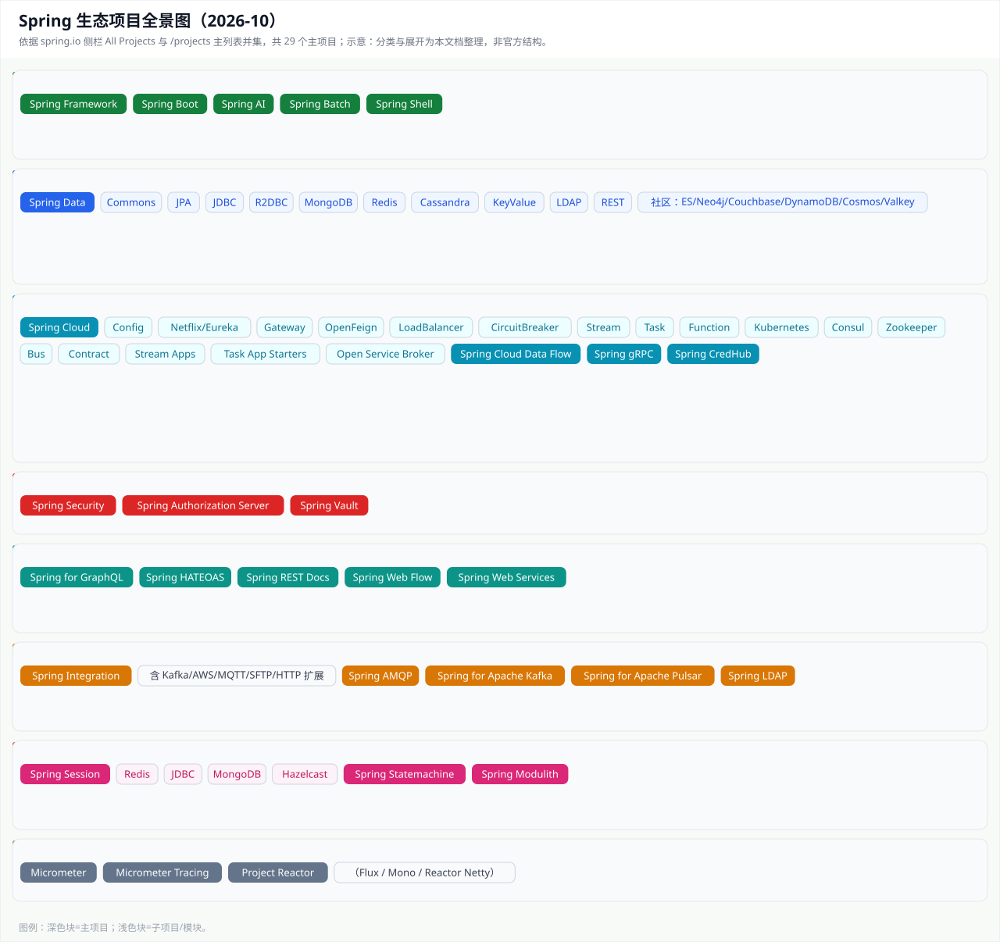
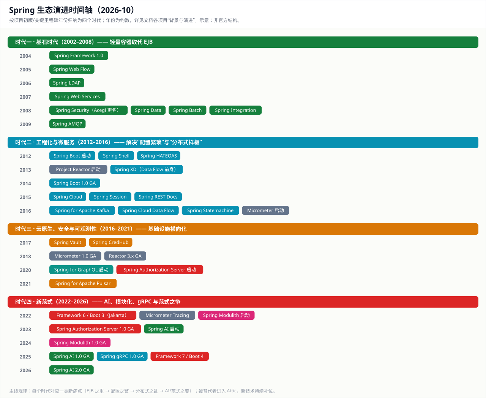
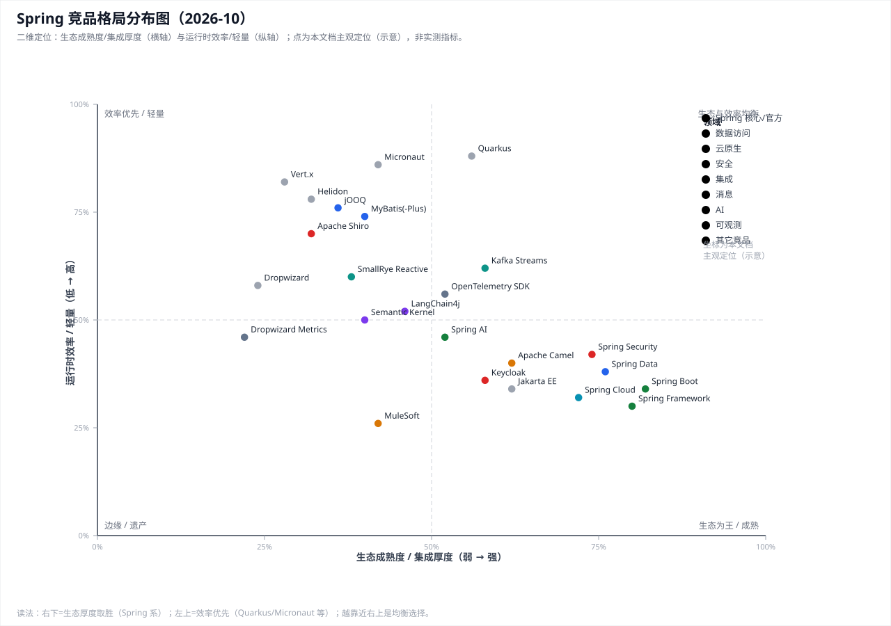

# Spring All Projects 深度分析

> **分析对象**：https://spring.io/projects/spring-boot 左侧栏 "All Projects" 与 https://spring.io/projects 主列表的并集（快照 2026-10-01），合计 29 个主项目。
> **侧栏口径**：侧栏含 25 项；/projects 主列表另有 Spring Cloud Data Flow、Spring Authorization Server、Spring Statemachine 三项（未列侧栏，同属官方体系，一并分析）；Micrometer Tracing 项目页存在（未列侧栏），与 Micrometer 配套，一并分析。
> **子项目口径**：伞形项目（Spring Data、Spring Cloud、Spring Session 等）的子节点采用同一框架递归分析；同一工件内模块（如 Spring Security 的 core/web）只标注不展开。
> **分析方法（六维）**：背景与演进 → 要解决的问题 → 解决方案（核心机制） → 竞品与定位 → 约束与缺点 → 适用场景与选型建议。版本以页面标注为准；历史时间点为公认事实，个别以"约/年代"表述。
> **版本记录**：v1 按五维简析（24 项）；v2 补侧栏遗漏项（Micrometer、Project Reactor、Spring Vault、Spring CredHub、Micrometer Tracing）并全量升级为六维深度版（29 项）。

---

## 总览

| # | 项目 | 页面标注版本 | 类别 | 子项目 | 初版年份（约） |
|---|---|---|---|---|---|
| 1 | Spring Boot | 4.0.6+ | 应用开发与核心 | 否（starter 体系） | 2012 启动 / 2014 GA |
| 2 | Spring Framework | 7.0.7+ | 应用开发与核心 | 否（内部模块） | 2004 |
| 3 | Spring Data | 2025.1.0+ | 数据访问 | 是（10+ 模块） | 2008 |
| 4 | Spring Cloud | 2025.1.1+ | 云原生与分布式 | 是（15 个子项目） | 2015 |
| 5 | Spring Cloud Data Flow | 2.11.5+ | 云原生与分布式 | 是（Stream/Task 应用） | 2016（前身 XD 2013） |
| 6 | Spring gRPC | 1.0.3+ | 云原生与分布式 | 否 | 2025 |
| 7 | Spring Security | 7.0.5+ | 安全 | 否（内部模块） | 2003（Acegi）/2008 更名 |
| 8 | Spring Authorization Server | 1.5.7+ | 安全 | 否 | 2020 启动 / 2023 GA |
| 9 | Spring for GraphQL | 2.0.3+ | Web 与 API | 否 | 2020 启动 / 2022 GA |
| 10 | Spring Session | 4.0.3+ | 会话与状态 | 是（4 种实现） | 2015 |
| 11 | Spring Integration | 7.0.4+ | 消息与集成 | 是（扩展模块族） | 2008 |
| 12 | Spring HATEOAS | 3.0.2+ | Web 与 API | 否 | 2012 |
| 13 | Spring Modulith | 2.0.6+ | 架构与治理 | 否 | 2022 启动 / 2024 GA |
| 14 | Spring REST Docs | 4.0.0+ | Web 与 API | 是（扩展） | 2015 |
| 15 | Spring AI | 1.1.6+ | 应用开发与核心 | 是（适配模块族） | 2023 启动 / 2025 GA |
| 16 | Spring Batch | 6.0.3+ | 应用开发与核心 | 否 | 2008 |
| 17 | Spring AMQP | 4.0.3+ | 消息与集成 | 否 | 2009 |
| 18 | Spring for Apache Kafka | 4.0.5+ | 消息与集成 | 否 | 2016 |
| 19 | Spring LDAP | 4.0.3+ | 消息与集成 | 否 | 2006 |
| 20 | Spring for Apache Pulsar | 2.0.5+ | 消息与集成 | 否 | 2021 |
| 21 | Spring Shell | 4.0.2+ | 应用开发与核心 | 否 | 2012 |
| 22 | Spring Statemachine | 4.0.1+ | 会话与状态 | 否 | 2016 |
| 23 | Spring Web Flow | 4.0.0+ | Web 与 API | 否 | 2005 |
| 24 | Spring Web Services | 5.0.1+ | Web 与 API | 否 | 2007 |
| 25 | Micrometer | 1.17.x | 可观测性 | 否 | 2016 启动 / 2018 GA |
| 26 | Micrometer Tracing | 1.7.x | 可观测性 | 否（项目页存在，未列侧栏） | 2022 |
| 27 | Project Reactor | 2025.0.x（Core 3.8.x） | 可观测性与响应式 | 否（内部模块） | 2013 启动 / 3.x 2018 |
| 28 | Spring Vault | 4.x | 安全 | 否 | 2017 |
| 29 | Spring CredHub | 低活跃 | 云原生与分布式 | 否 | 2017 |

---

## 生态全景与演进（可视化）

---

## 一、应用开发与核心

### 1. Spring Boot（4.0.x）

**背景与演进**
- 诞生动因：2012 年前后，Spring 生态"功能完备但体验糟糕"——XML 配置动辄几十行、依赖版本靠手工对齐、部署要打 WAR 交给外置容器、第三方库集成各自为政。Pivotal 发起 Spring Boot（核心推动者 Phil Webb），1.0 于 2014 年发布，提出"just run"（可执行 JAR 直接运行）的工程化理念。
- 版本里程碑：2.0（2018）拥抱响应式（WebFlux 联动）与 Spring 5；3.0（2022-11）随 Framework 6 升级到 Java 17 + Jakarta EE，并把 GraalVM 原生镜像纳入官方支持（替代此前的 Spring Native 实验项目）；3.2（2023）支持虚拟线程；4.0（2025-11）随 Framework 7 发布，对 spring-boot 工程做模块化拆分（spring-boot-core 等）、整合可观测性（Micrometer 1.14+）与 HTTP 接口客户端。
- 定位：Spring 生态的"入口产品"——绝大多数新项目通过 start.spring.io 生成 Boot 工程。

**要解决的问题**
- 配置摩擦：XML/样板配置量大，新人上手门槛高；
- 依赖地狱：jar 版本冲突、传递依赖不可控；
- 部署成本：WAR + 外置容器部署链路长，无法快速试运行；
- 生产就绪：健康检查、指标、日志、外部化配置等能力需要"开箱即得"；
- 生态割裂：大量第三方库（数据库、消息、缓存、云服务）接入方式不统一。

**解决方案（核心机制）**
- 自动配置：`@EnableAutoConfiguration` + 条件装配（`@ConditionalOnClass` 等），按 classpath 内容自动装配 Bean，无需显式声明；
- Starter 体系：把"依赖 + 自动配置 + 默认属性"打包成一个 starter，一行依赖即可接入一个技术栈；
- 内嵌容器：可执行 JAR 内嵌 Tomcat/Jetty/Undertow，免部署直接运行；
- 外部化配置：application.properties/yaml、环境变量、命令行参数的优先级体系 + `@ConfigurationProperties` 类型安全绑定；
- Actuator：health、metrics、env、loggers 等生产端点，配合 Micrometer 输出指标；
- 4.0 增强：模块化内核、可观测性（OpenTelemetry 对齐）、HTTP Interface 客户端、AOT 编译与原生镜像支持持续成熟。

**竞品与定位**
- Quarkus（Red Hat）：AOT 编译 + GraalVM 原生优先，冷启动毫秒级、内存小，抢走大量云原生/Serverless 用户；弱点是生态与人才储备不如 Spring；
- Micronaut：编译期 DI、无反射，GraalVM 友好，社区与第三方库规模小；
- Helidon / Vert.x / Dropwizard：细分场景（云原生 SE、响应式、轻量 API），均难撼动主流企业市场；
- Jakarta EE / MicroProfile：标准路线，兼容性优先、创新慢；
- 定位结论：Boot 赢在**生态厚度**（可集成库最多）与**工程化完善度**（文档、IDE 支持、运维工具），输在**运行时开销**与**技术迭代速度**。

**约束与缺点**
- 黑盒排障：自动配置"魔法"在异常时难以定位根因，需依赖 `--debug` 条件报告等手段；
- 资源开销：启动时间与内存占用高于 Quarkus/Micronaut，对 Serverless 冷启动敏感场景不友好；
- 版本矩阵：Boot 与 Spring Cloud/Data 等按发布列车对齐，升级牵一发动全身；2→3→4 的大版本迁移（Java、Jakarta、API 变更）成本高；
- 过度依赖：Starter 一键引入容易堆出大量无用依赖，镜像体积膨胀；
- 意见化束缚：非标准需求（自定义容器、特殊类加载）需要绕过默认机制，反而更繁琐。

**适用场景与选型建议**
- 适合：Java 企业应用、微服务、快速交付、团队以 Spring 技能为主、需要长期可维护生态；
- 不适合/需权衡：极端冷启动与内存敏感（Serverless）、全原生镜像、对依赖体积有严格约束的场景——可评估 Quarkus/Micronaut。

### 2. Spring Framework（7.0.x）

**背景与演进**
- 诞生动因：2002 年 Rod Johnson 出版《Expert One-on-One J2EE Design and Development》，系统批评 EJB 的复杂度，提出轻量级容器思想；2004 年 Spring 1.0 发布，以 IoC + AOP 为核心重构企业 Java 开发方式。
- 版本里程碑：2.5（2007）引入注解驱动开发；3.0（2009）推出 JavaConfig 与 SpEL；4.0（2013）支持 Java 8；5.0（2017）引入响应式 WebFlux 与 Reactor 集成；6.0（2022）转向 Jakarta EE 9、Java 17 基线；6.1（2023）支持虚拟线程；7.0（2025）进一步精简模块、对齐 Jakarta EE 11 与可观测性。
- 定位：所有 Spring 项目的基座，自身是"框架的框架"。

**要解决的问题**
- 企业 Java 的通用复杂度：对象生命周期管理（DI）、横切关注点（AOP：事务/日志/安全）、事务抽象（跨 JDBC/JTA/ORM）、Web 层、数据访问层、消息集成；
- 用轻量 POJO + 容器管理替代 EJB 的重量级编程模型。

**解决方案（核心机制）**
- IoC 容器：Bean 定义、依赖注入、作用域与生命周期回调；支持注解（@Component/@Autowired/@Configuration）与编程式注册；
- AOP：基于动态代理（JDK 代理/CGLIB）的声明式横切，事务注解（@Transactional）是最大受益者；
- 抽象层：PlatformTransactionManager、DataSource 模板（JdbcTemplate/JdbcClient）、统一异常体系（DataAccessException）；
- Web：Servlet 栈 Spring MVC 与响应式栈 WebFlux（基于 Reactor）双栈并存；
- 资源抽象、SpEL 表达式、事件机制、校验与类型转换等基础设施。

**竞品与定位**
- Jakarta EE（CDI + EJB）：标准路线，容器厂商支持但创新慢、配置重；
- Google Guice：轻量 DI 但缺 AOP 事务/Web 全栈能力；
- Micronaut 的编译期 DI：启动快但生态小；
- 定位结论：Framework 是"事实标准"，任何框架级竞品都难以替代其**生态位**，但被 Quarkus/Micronaut 在**运行时效率**维度分食。

**约束与缺点**
- 历史包袱：为兼容旧配置保留大量 XML/回调式 API，新增开发者容易踩"新旧两套"的坑；
- 代理限制：JDK 代理不支持类内部自调用切入、final 类/方法无法代理，CGLIB 也有边界；
- 学习曲线：容器模型 + AOP + 事务传播 + 双 Web 栈，概念密度高；
- 版本约束：作为底层，其大版本（6→7）直接决定全生态升级节奏（Jakarta、Java 版本）。

**适用场景与选型建议**
- 适合：所有基于 Spring 的 Java 应用（通过 Boot 使用为主）；
- 直接使用裸 Framework 仅适合高度定制或框架开发者；普通项目应使用 Boot 封装。

### 15. Spring AI（1.1.x，2.0 于 2026-06 GA）

**背景与演进**
- 诞生动因：2022 年底 ChatGPT 引爆大模型浪潮后，Java 企业应用接入 LLM 的需求爆发，但生态里只有 Python/JS 的 LangChain 等框架；2023 年 Spring 团队启动 Spring AI，2023-11 发布 0.8.0 里程碑，2025-05 发布 1.0 GA，2026-06 发布 2.0。
- 演进主线：从"聊天客户端"逐步扩展为 AI 工程框架——模型适配、向量库、RAG、MCP、Agent 编排、可观测性、评估。

**要解决的问题**
- 供应商碎片化：OpenAI/Anthropic/Gemini/Ollama/本地模型 API 各不相同，换模型要改代码；
- RAG 工程化：文档切分、向量化、检索、注入、引用溯源整条链路无标准；
- 上下文与工具调用：Function Calling、结构化输出、多轮记忆管理；
- 运维治理：Token 成本、限流、可观测性、提示词版本管理。

**解决方案（核心机制）**
- 模型抽象：ChatClient 统一对话接口，底层适配各厂商（OpenAI、Anthropic、Ollama、Google、Azure、Bedrock 等）；
- 向量存储抽象：pgvector、Redis、MongoDB、Chroma、Qdrant、Milvus、Weaviate 等统一 API；
- RAG 框架：Document 读取/切分/嵌入/检索/增强的流水线组件；
- MCP 支持：作为客户端接入模型上下文协议生态，扩展工具与数据源；
- 与 Boot 深度集成：自动配置、Starter、可观测性（Micrometer 指标 + Tracing）。

**竞品与定位**
- LangChain4j（Java，社区活跃）：API 更贴近 LangChain 风格，生态成长快；Spring AI 胜在与 Boot/Spring 生态一体化与官方支持；
- Microsoft Semantic Kernel：跨语言，偏企业编排；
- LangChain/LangGraph（Python）：功能最全但 Java 团队无法直接使用；
- LlamaIndex：检索/数据侧更强；
- 官方 SDK（openai-java 等）：能力最全但无框架化抽象。
- 定位结论：Java 企业侧"框架化 AI"的事实选择，但整体仍落后 Python 生态半代。

**约束与缺点**
- 项目年轻：API 在 1.x→2.0 仍有破坏性变更，升级成本高；
- 抽象泄漏：模型特有能力（多模态、特殊参数）需要透传，抽象不完整；
- 生产治理薄：评测（Eval）、提示词管理、成本治理、幻觉防护工具仍不成熟；
- 生态差：Java 侧 AI 组件（Agent 框架、工具库）远少于 Python；
- 性能与成本：Java 调 LLM 的吞吐优化依赖团队经验。

**适用场景与选型建议**
- 适合：Java 存量系统接入 AI 能力、需要与 Spring 数据/安全/云生态协同的企业应用；
- 谨慎：Agent 编排深度复杂、高度依赖前沿模型能力的场景，可对比 LangChain4j 后决定。

### 16. Spring Batch（6.0.x）

**背景与演进**
- 诞生动因：2000 年代企业 ETL、报表、批量结算等离线处理需求大，但手写批处理代码在事务边界、断点续跑、失败重试上极易出错；Spring Batch 于 2008 年发布 1.0，成为 Java 批处理事实标准。
- 版本：4.x（2018，Java 8）、5.x（2022，Jakarta/JPA 2.2）、6.0（2025，随 Boot 4/Framework 7）。

**要解决的问题**
- 大容量数据的分块（Chunk）处理与内存控制；
- 失败恢复：跳过（skip）/重试（retry）/重启（restart）语义；
- 作业元数据：Job/Step 执行状态、参数、统计信息可追踪；
- 事务边界：每块一个事务，失败只回滚当前块；
- 并发与分区：多线程、多实例、按数据分区并行。

**解决方案（核心机制）**
- Job → Step → Chunk（读-处理-写）分层模型；
- Reader/Processor/Writer 接口族 + 大量内置实现（文件、DB、消息）；
- JobRepository 持久化执行元数据（数据库表）；
- 决策器/监听器/跳过策略/重试模板等扩展点；
- 与 Boot 集成（spring-boot-starter-batch）、与 Spring Cloud Task 组合做云上短任务。

**竞品与定位**
- Apache Beam：统一批流模型、云原生 Runner（Dataflow/Spark/Flink），但 Java 侧开发体验重；
- Spark/Flink：大数据规模批处理，超出 Spring Batch 的"企业级中量"定位；
- JBeret（JSR-352）：标准批处理 API，生态弱；
- Talend/商业 ETL：图形化，锁厂商。
- 定位结论：Spring Batch 是"应用内嵌、轻中量、强事务"批处理的最成熟选择；大数据量/流批一体交给 Spark/Flink。

**约束与缺点**
- 面向批而非流：实时流处理需另配 Kafka/Stream；
- 配置繁重：Job/Step 定义与元数据表维护成本；
- 分布式薄弱：跨节点分区依赖外部调度与数据库锁，水平扩展不如 Spark；
- 元数据强耦合 DB：作业执行依赖数据库可用性；
- 学习曲线：概念（Step/Chunk/ItemWriter/JobRepository）多。

**适用场景与选型建议**
- 适合：报表生成、数据迁移、日终批处理、对账结算等企业批量任务；
- 数据规模到 TB 级/需要流批一体时，评估 Spark/Flink/Beam。

### 21. Spring Shell（4.0.x）

**背景与演进**
- 诞生动因：2010 年代起，运维工具、开发者 CLI、内部管理终端需要"用 Spring 快速构建交互式命令行应用"；Spring Shell 1.x 于 2012 年前后出现，2018 年 2.0 重写（基于 JLine），3.x（2022）随 Boot 3，4.0（2025）随 Boot 4。
- 定位：交互式 CLI 应用的 Spring 脚手架，非批处理/脚本工具（那是 Boot CLI/JBang 的范畴）。

**要解决的问题**
- CLI 通用工程：参数解析与校验、子命令、自动补全、ANSI 彩色输出、命令历史、帮助文档；
- 复用 Spring 生态：让 CLI 内直接注入 Service/DAO，与业务代码同构。

**解决方案（核心机制）**
- 注解驱动命令：`@ShellComponent` + `@ShellMethod`，方法即命令；
- JLine 3 终端交互：补全、行编辑、ANSI；
- 命令分组、帮助、参数绑定与校验、退出码；
- 与 Spring Boot 集成：依赖注入、配置、Actuator 可选。

**竞品与定位**
- Picocli：轻量、无框架依赖，JVM 生态最流行的 CLI 库；
- JCommander / Airline：同类轻量 CLI 库；
- JBang：脚本化 Java 快速运行，非交互式框架；
- 定位结论：需要"业务逻辑注入 + 完整 Spring 能力"的交互式 CLI 用 Spring Shell；纯工具型 CLI 用 Picocli 更轻。

**约束与缺点**
- 场景窄：交互式 shell 需求本就不多；
- 终端兼容性：JLine 在部分终端（Windows 老终端、无 TTY 环境）表现不佳；
- 重量：为 CLI 引入整个 Spring 上下文，启动慢于 Picocli；
- 文档与示例少、社区活跃度低。

**适用场景与选型建议**
- 适合：运维控制台、管理终端、需要连数据库/服务端的内部 CLI；
- 轻量脚本/管道型 CLI 用 Picocli/JBang。
## 二、数据访问

### 3. Spring Data（2025.x，发布列车）— 伞形项目

**背景与演进**
- 诞生动因：2000 年代末每个数据存储都有专属访问 API（JPA、Mongo、Redis、Cassandra…），DAO 样板代码与学习成本高；2008 年起 Spring 团队（Oliver Gierke 等）以"一致、熟悉的 Spring 编程模型"统一数据访问。
- 演进：以"发布列车 + BOM"管理模块版本（CalVer，如 2025.1）；与存储厂商（MongoDB、Redis 等）合作开发各模块；主模块与社区模块并存。

**要解决的问题**
- 数据访问样板：Repository 重复实现、转换/映射代码；
- 查询开发效率：简单查询不必写实现；
- 多存储统一心智：团队只需学一套 Repository 模型；
- 基础设施：分页、排序、审计、事件。

**解决方案（核心机制）**
- Repository 接口抽象：接口方法名自动推导查询（`findByName` → 对应查询），也可用 `@Query`/`@DerivedQuery` 自定义；
- 对象映射：各存储模块提供 POJO ↔ 存储对象映射（JPA 实体、Mongo Document、Redis Hash…）；
- 通用能力：Pageable/Sort、审计（@CreatedDate 等）、领域事件发布、自定义实现混入（fragment 接口）；
- Spring Data REST：把 Repository 直接导出为 HAL 超媒体 REST 资源。

**竞品与定位**
- MyBatis/MyBatis-Plus：SQL 可控、国内普及率高，但无跨存储统一模型；
- jOOQ：类型安全 SQL，强类型与 DSL 更优，无 Repository 抽象；
- Quarkus Panache / Micronaut Data：同类 Repository 抽象，绑定各自框架；
- 定位结论：Spring Data 是"多存储统一抽象"的唯一主流选择；单库场景常被 MyBatis/jOOQ 分食。

**约束与缺点**
- 方法名魔法：复杂查询（动态条件、聚合）靠 @Query/Specification/QueryDSL，可读性与灵活性下降；
- 抽象泄漏：各存储特性（Mongo 聚合、Cassandra 一致性）仍需下沉到原生 API；
- 性能陷阱：懒加载 N+1、分页大偏移、隐式关联查询等问题需要经验；
- 模块一致性差异：JPA 与 Redis 等模块行为与文档成熟度不一致；
- 跨存储（cross-store）仍是实验能力，多库事务需外部方案（SAGA/2PC）。

**适用场景与选型建议**
- 适合：以 Spring 为主的业务系统、多存储并存、追求开发效率；
- 需要极致 SQL 控制/复杂报表的场景，单用 jOOQ/MyBatis 或二者混用。

#### 子项目分析（六维框架）

##### Spring Data Commons
- **背景与演进**：2008 年 Spring Data 起步时，各存储模块需要共享 Repository 基座与查询抽象，Commons 承担"公共内核"角色，随发布列车持续迭代。
- **要解决的问题**：Repository 接口族、方法名查询推导、分页排序、审计、领域事件、类型转换等跨存储公共能力，避免各模块重复造轮子。
- **解决方案（核心机制）**：Repository 基础接口与实现骨架、查询推导引擎（方法名 → Criteria 树）、Pageable/Sort 抽象、审计 SPI、ConversionService 集成；各模块通过继承与 SPI 扩展。
- **竞品与定位**：无直接竞品（属基础设施层），间接对标 JPA Criteria API 与各类 DAO 框架。
- **约束与缺点**：抽象泄漏（存储特性差异仍会上浮到上层 API）；版本演进牵动全部子模块；新存储接入成本高（需实现大量 SPI 与解析器）。
- **适用场景与选型建议**：普通业务开发者不直接接触；框架/模块开发者与需要自定义存储接入的团队使用。

##### Spring Data JPA
- **背景与演进**：JPA/Hibernate 成为 ORM 事实标准后 DAO 样板重复；Spring Data JPA 随 Data 项目早期成熟（约 2010 年代），是**采用最广**的模块。
- **要解决的问题**：CRUD/分页/审计样板；简单查询免写实现；复杂查询提供多条出口（@Query、Specification、QueryDSL）。
- **解决方案（核心机制）**：Repository + 方法名派生查询 + @Query + Specification/QueryDSL + 审计与实体监听；透明集成 Hibernate 与 JPA 2.x 标准。
- **竞品与定位**：MyBatis/MyBatis-Plus（SQL 可控、国内主流）、jOOQ（类型安全 SQL）、Panache（Quarkus）；JPA 模块赢在"零实现 CRUD + 标准 JPA 兼容 + 生态最大"。
- **约束与缺点**：复杂报表/动态查询力不从心；N+1、懒加载陷阱频发；JPQL 学习成本；Specification 代码可读性差；跨数据库方言差异需注意；批量写性能需绕过 Repository 用 EntityManager/JdbcTemplate。
- **适用场景与选型建议**：业务以 CRUD + 实体关系为主的团队；复杂查询多的项目可 JPA 与 jOOQ/MyBatis 混用（CQRS 思路）。

##### Spring Data JDBC
- **背景与演进**：约 2017 年起随发布列车推出，面向"不要 ORM 完整映射"的轻量路线，与 DDD 聚合风潮契合。
- **要解决的问题**：保留 Repository 开发体验的同时，去掉懒加载/一级缓存/代理等 ORM 心智，SQL 与事务完全可控。
- **解决方案（核心机制）**：聚合根级映射（@AggregateReference/@Id）、无懒加载无缓存、直接 JDBC、事务由 Spring 统一管理。
- **竞品与定位**：jOOQ（强类型 DSL）、MyBatis（SQL 映射）、JdbcClient（Spring 6.1+ 模板）；JDBC 模块适合"简单关系模型 + Repository 开发效率"。
- **约束与缺点**：无对象关系图，多表关联需手写；聚合（Aggregate）设计有学习门槛；功能面小于 JPA；复杂领域模型使用成本高。
- **适用场景与选型建议**：DDD 聚合风格、SQL 偏好、不想承担 ORM 复杂性的项目；重关系/重报表场景选 JPA 或 jOOQ。

##### Spring Data R2DBC
- **背景与演进**：随响应式栈（WebFlux/Reactor）在 2018–2019 年推出，提供非阻塞数据库访问的 Repository 层。
- **要解决的问题**：响应式应用不能使用阻塞 JDBC；需要背压感知的数据库访问、事务与连接池。
- **解决方案（核心机制）**：R2DBC 规范驱动 + 响应式 Repository（Mono/Flux 返回）、R2dbcEntityTemplate、ReactiveTransactionManager/TransactionalOperator 管理事务。
- **竞品与定位**：Vert.x 数据库客户端、Jasync-sql、各库原生响应式驱动；R2DBC 是 Spring 响应式数据访问的标准路径。
- **约束与缺点**：驱动覆盖不全（部分数据库无 R2DBC 驱动或质量参差）；响应式事务与连接池语义与传统经验不同，排查复杂；与阻塞代码混用会阻塞线程池；学习曲线高。
- **适用场景与选型建议**：WebFlux 全响应式链路（网关/高连接服务）；非响应式团队不建议引入，收益不抵成本。

##### Spring Data MongoDB
- **背景与演进**：随 MongoDB（2009+）兴起开发，MongoDB 官方深度参与维护，是文档数据库的 Spring 标准访问层。
- **要解决的问题**：POJO ↔ BSON 映射、Repository CRUD、聚合管道、地理查询、审计、GridFS。
- **解决方案（核心机制）**：@Document 映射 + MongoTemplate/MongoRepository + 聚合管道 API + GridFS + 副本集事务。
- **竞品与定位**：Morphia（社区 ODM）、原生 Driver、Micronaut MongoDB；Spring 生态内 MongoDB 访问无悬念选它。
- **约束与缺点**：复杂聚合管道 API 冗长；跨文档事务受部署形态（副本集/分片）限制；与关系型思维混用易误用（嵌入 vs 引用）；索引设计仍需 DBA 经验。
- **适用场景与选型建议**：文档模型业务（内容、画像、日志、IoT 时序）；与 JPA/Redis 并存时注意一致性设计。

##### Spring Data Redis
- **背景与演进**：随 Redis 在缓存/会话/计数/排行榜场景普及开发，官方长期维护，Lettuce 为默认连接驱动。
- **要解决的问题**：客户端 API 碎片（Jedis/Lettuce）；缓存注解与 Redis 统一接入；序列化、连接池与响应式支持。
- **解决方案（核心机制）**：RedisTemplate/ReactiveRedisTemplate、@Cacheable 缓存抽象、RedisRepository（@Hash 映射）、Pub/Sub 与 Stream 支持、连接工厂管理。
- **竞品与定位**：Redisson（分布式锁/对象更丰富）、直接 Lettuce/Jedis、Spring Cache 其它实现（Caffeine 等）；Redis 模块是 Spring 缓存/会话的默认落点。
- **约束与缺点**：序列化策略配置易错且影响跨语言/跨版本兼容；TTL 与缓存一致性靠约定管理；Repository 抽象使用率低；热点穿透/击穿/雪崩需自建防护。
- **适用场景与选型建议**：缓存、会话、计数、排行榜、Pub/Sub；分布式锁等高级场景评估 Redisson 或在 Redis 模块上自封装。

##### Spring Data for Apache Cassandra
- **背景与演进**：随 Cassandra 在 2010 年代大规模分布式场景采用开发，与 DataStax 合作维护。
- **要解决的问题**：宽表建模下的 CQL 映射、Repository CRUD、一致性级别配置、批量写入。
- **解决方案（核心机制）**：@Table/@PrimaryKey/@Column 注解映射、CassandraRepository、Reactive 支持、一致性级别声明、审计。
- **竞品与定位**：DataStax Java Driver 直用；Spring 生态内 Cassandra 访问的唯一主流选择。
- **约束与缺点**：无 JOIN、二级索引受限，查询设计被数据模型强约束；建模门槛高（宽表/分区键设计）；模块热度低于 JPA/Mongo；迁移成本高（重建模）。
- **适用场景与选型建议**：海量写入、时间序列、多可用区写入扩展场景；选型前必须先完成数据建模验证。

##### Spring Data KeyValue
- **背景与演进**：作为"基座型"模块，提供基于 Map 的通用 KV Repository 与构建自定义 KV 模块的 SPI；Spring Data Vault 即构建其上。
- **要解决的问题**：让 KV 类存储（内存 Map、Vault、自研存储）也能享受 Repository 抽象。
- **解决方案（核心机制）**：Map 实现 + KeyValueTemplate + 模块化 SPI。
- **竞品与定位**：无直接竞品（属扩展基座）。
- **约束与缺点**：功能极简，仅覆盖基本 CRUD/查询；普通业务几乎不直接使用。
- **适用场景与选型建议**：框架/模块开发者；业务项目不直接依赖。

##### Spring Data LDAP
- **背景与演进**：与 Spring LDAP 配套，把 LDAP 目录访问 Repository 化、注解化（约 2010 年代早期）。
- **要解决的问题**：LDAP 搜索/认证/CRUD 样板；属性 ↔ 字段映射。
- **解决方案（核心机制）**：@Entry/@Id/@Attribute 注解映射 + LdapRepository + 内嵌 LDAP（UnboundID）测试支持。
- **竞品与定位**：UnboundID LDAP SDK、Apache Directory API、JNDI 直用；Spring 生态内最省事的 LDAP 访问方式。
- **约束与缺点**：场景小众；文档与社区活跃度低；LDAP 技术栈整体被云 IdP/SCIM 替代。
- **适用场景与选型建议**：对接 AD/OpenLDAP 的组织架构查询与认证；新身份体系优先云 IdP（OIDC/SCIM）。

##### Spring Data REST
- **背景与演进**：2012 年前后推出，把 Repository 直接导出为 HAL 超媒体 REST 资源。
- **要解决的问题**：为 Repository 快速提供 REST 接口、减少 Controller 样板、统一分页与关联导航。
- **解决方案（核心机制）**：Repository 自动导出（/实体名）、分页/投影（Projection）/事件回调、HAL 媒体类型。
- **竞品与定位**：手写 Controller + springdoc、JSON:API 实现（elide 等）；适合原型与内部工具，生产接口仍多手写。
- **约束与缺点**：URL 与字段粒度控制力弱；安全与校验需额外配置；HATEOAS 客户端工具稀缺；序列化与业务规则定制受限。
- **适用场景与选型建议**：快速原型、管理后台、内部简单 CRUD 服务；对外/正式 API 建议手写 Controller。

##### 社区模块（Couchbase / Elasticsearch / Neo4j / DynamoDB / Azure Cosmos / Valkey / Hazelcast / Aerospike / ArangoDB 等）
- **背景与演进**：由社区/厂商维护，部分纳入发布列车（Couchbase、Elasticsearch、Neo4j 在列车内），部分独立发布；历史上有 Geode/GemFire/Solr 已退役。
- **要解决的问题**：为长尾数据库提供与官方模块一致的 Repository 开发体验。
- **解决方案（核心机制）**：各自实现对象映射 + Repository + 存储特性透传（Elasticsearch 查询 DSL、Neo4j Cypher、DynamoDB 分区键等）。
- **竞品与定位**：各厂商原生 SDK；Spring 模块在 Spring 生态内更省事。
- **约束与缺点**：维护节奏与版本对齐参差；质量与文档依赖社区投入；部分模块长期停留在老版本；选型需核实活跃度与兼容性。
- **适用场景与选型建议**：存储已锁定该数据库时使用；否则优先官方维护的模块；冷门存储评估原生 SDK。

## 三、云原生与分布式

### 4. Spring Cloud（2025.x，发布列车，如 2025.1 "Oakwood"）— 伞形项目

**背景与演进**
- 诞生动因：2014–2016 年微服务浪潮中，分布式系统的公共模式（配置、注册发现、路由、熔断、消息、契约测试）被反复重复实现；Netflix 开源其微服务中间件（Eureka、Hystrix、Zuul、Ribbon），Spring Cloud 于 2015 年发布 1.0，把这些模式"Spring 化"。
- 演进：伦敦地铁站名发布列车（Angel→Camden→…→Hoxton）后转年份制（2020.0→2025.x）；逐步"去 Netflix 化"：Hystrix→Resilience4j、Zuul→Gateway、Ribbon→LoadBalancer、Sleuth→Micrometer Tracing；与 K8s 原生能力重叠后定位转向"非 K8s 环境 + 补充性抽象"。

**要解决的问题**
- 配置管理：版本化、集中化、可刷新的外部配置；
- 服务发现：动态实例注册与消费；
- 调用治理：声明式 HTTP 客户端、负载均衡、熔断/限流；
- 入口路由：统一网关；
- 分布式消息与事件传播；
- 短生命周期任务与契约测试。

**解决方案（核心机制）**
- 发布列车 + BOM：用 spring-cloud-dependencies 统一各子项目版本，与 Boot 版本强绑定（兼容矩阵见官方文档）；
- Starter 即插即用：加依赖即启用能力（自动配置）；
- 各子项目以独立库形式协作（见下）。

**竞品与定位**
- Kubernetes 原生（Service/ConfigMap/Ingress/探针）+ Istio/Envoy：K8s 已覆盖发现/配置/网关/熔断，Spring Cloud 在纯 K8s 环境价值被压缩；
- Apache Dubbo / Spring Cloud Alibaba：国内高性能 RPC 与治理路线，生态更偏国产组件（Nacos/Sentinel）；
- MicroProfile：标准路线，弱；
- Dapr：跨语言 sidecar 路线，理念先进但采用率有限。
- 定位结论：Spring Cloud 仍是 **Java 微服务治理的默认选择**，尤其非 K8s 或轻 K8s 环境；K8s 深度用户会逐步削减其组件。

**约束与缺点**
- 版本对齐痛：列车与 Boot 版本一一对应，升级必须同步，团队常被"兼容矩阵"卡住；
- 组件维护分化：Netflix 系组件维护转冷、社区活跃度下降；
- 与 K8s 重叠：在 K8s 上同时用两套发现/配置机制，概念冗余、排障困难；
- 学习曲线陡：概念多（DiscoveryClient、Feign、Gateway 过滤器、Stream Binder…），抽象层排障难；
- 国产化适配：Spring Cloud Alibaba 为独立分支，与官方列车同步有滞后。

**适用场景与选型建议**
- 适合：Java 微服务体系（尤其非 K8s 或多云环境）、快速搭建治理能力；
- K8s 深度用户：优先 K8s 原生 + 网格，仅保留 Config/Gateway 等补充组件。

#### 子项目分析（六维框架）

##### Spring Cloud Config
- **背景与演进**：微服务配置散落各仓库、变更不可追踪；Config 于 2014–2015 年推出，Git 后端集中配置成为 Spring 微服务标配。
- **要解决的问题**：集中化/版本化配置、变更可追溯、多环境隔离、动态刷新、敏感信息加密。
- **解决方案（核心机制）**：Config Server（Git/SVN/文件系统后端）+ 客户端；配置映射到 Spring Environment；@RefreshScope 动态刷新；对称/非对称加密支持。
- **竞品与定位**：Nacos（国内主流，配置+注册一体）、Apollo（携程，可视化与灰度强）、Consul KV、K8s ConfigMap + External Secrets；Config 胜在 Spring 原生集成。
- **约束与缺点**：Server 需自建高可用（多实例 + Git 可用性）；@RefreshScope 刷新有失效窗口；加密密钥管理麻烦；无发布/灰度/审计界面，弱于 Apollo/Nacos。
- **适用场景与选型建议**：非 K8s 或轻 K8s 的 Spring 微服务；国内团队常直接用 Nacos 替代。

##### Spring Cloud Netflix（Eureka）
- **背景与演进**：2014–2015 年集成 Netflix OSS，Eureka 成为最早的注册中心事实标准；Netflix 停更后长期处于维护模式。
- **要解决的问题**：服务实例注册与发现、心跳续约、故障剔除、自我保护。
- **解决方案（核心机制）**：Eureka Server/Client、REST 注册发现、心跳与健康检查、区域/多实例支持。
- **竞品与定位**：Nacos（国内主流）、Consul、K8s Service 发现；Eureka 胜在简单直接、AP 语义（可用性优先）。
- **约束与缺点**：Netflix 基本停更（Eureka 2 未发布）；无配置中心能力（需配 Config）；多机房/数据一致性场景能力不足；新项目建议迁移 Nacos/Consul/K8s。
- **适用场景与选型建议**：存量系统维护；新项目优先评估替代方案。

##### Spring Cloud Gateway
- **背景与演进**：2017–2018 年取代 Zuul 1，基于 WebFlux 的非阻塞网关，成为 Spring 系唯一官方网关。
- **要解决的问题**：统一入口、路由分发、鉴权、限流、重试、灰度、跨域。
- **解决方案（核心机制）**：路由 Predicate + 过滤器链（GlobalFilter/RouteFilter）、Redis RateLimiter 限流、重试、CORS、与 Spring Security 集成。
- **竞品与定位**：Kong/APISIX（OpenResty 系）、Nginx、Istio/Envoy（服务网格）；Gateway 胜在 Java/Spring 一体化与可编程性。
- **约束与缺点**：响应式栈排障困难（堆栈与数据流）；自定义过滤器需理解 Flux/背压；吞吐调优门槛高；与 Istio 并存时职责重叠；MVC 团队知识不通用。
- **适用场景与选型建议**：Java 微服务统一入口；多语言/边缘网关场景评估 Kong/APISIX。

##### Spring Cloud OpenFeign
- **背景与演进**：2016 年前后集成 Netflix Feign，2018 年起基于社区 OpenFeign，成为声明式 HTTP 客户端标准。
- **要解决的问题**：服务间调用样板（URL、序列化、超时、重试、负载均衡、熔断）。
- **解决方案（核心机制）**：@FeignClient 接口 + 自动装配 LoadBalancer/CircuitBreaker/日志/契约解码。
- **竞品与定位**：RestClient/WebClient（Spring 官方更"正统"）、Retrofit、Dubbo（RPC）；OpenFeign 胜在声明式与微服务治理集成。
- **约束与缺点**：动态代理排障困难；依赖上游 OpenFeign 维护节奏；性能低于直连 HTTP/RPC；新项目官方更推荐 RestClient。
- **适用场景与选型建议**：存量微服务互调；新项目可优先 RestClient/WebClient。

##### Spring Cloud LoadBalancer
- **背景与演进**：Ribbon 退役（2020 前后）后的官方替换，轻量客户端负载均衡。
- **要解决的问题**：服务实例选择策略、与 DiscoveryClient/Reactive 链路集成。
- **解决方案（核心机制）**：LoadBalancerClient/ReactiveLoadBalancer、轮询/随机等策略、可扩展自定义选择器。
- **竞品与定位**：Ribbon（退役）、Nacos 客户端负载均衡；官方 LoadBalancer 是默认替代。
- **约束与缺点**：功能精简（权重/区域/重试等高级策略需自实现）；文档少；与 Ribbon 配置迁移有差异。
- **适用场景与选型建议**：Spring Cloud 微服务默认组件；需要高级策略时自行扩展或换 Nacos。

##### Spring Cloud CircuitBreaker
- **背景与演进**：Hystrix 退役后（2018–2019）官方抽象，默认实现 Resilience4j。
- **要解决的问题**：熔断、限流、舱壁隔离、超时与重试的统一声明式能力。
- **解决方案（核心机制）**：@CircuitBreaker/@RateLimiter/@Bulkhead/@Retry + 与 Feign/Gateway/Reactive 自动集成。
- **竞品与定位**：Hystrix（退役）、阿里 Sentinel（功能更全、有控制台与可视化规则、国内流行）。
- **约束与缺点**：配置项多且语义易混淆；线程池隔离在响应式下适配复杂；指标与告警需自行接入；比 Sentinel 缺控制台与流控面板。
- **适用场景与选型建议**：简单熔断/重试场景足够；复杂限流/流控/可视化需求选 Sentinel。

##### Spring Cloud Stream
- **背景与演进**：2016 年前后推出，以 Binder 抽象屏蔽 Kafka/RabbitMQ 差异；API 从注解式（@StreamListener）演进到函数式（3.x+，Function 模型）。
- **要解决的问题**：消息驱动微服务的声明式开发、绑定可切换、分区、重试、DLQ 语义。
- **解决方案（核心机制）**：Function/Consumer/Supplier 编程模型 + Binder（Kafka/RabbitMQ）+ 绑定配置 + 与 Data Flow 集成。
- **竞品与定位**：SmallRye Reactive Messaging（Quarkus）、直接 Spring Kafka/AMQP、Kafka Streams；Stream 胜在"同一套代码换中间件"。
- **约束与缺点**：抽象泄漏（分区/消费组/死信细节仍需理解）；API 多次重构造成迁移成本；排障需深入 binder 内部；新项目官方倾向直用 Spring Kafka/AMQP。
- **适用场景与选型建议**：需要绑定可切换或配合 Data Flow 编排；否则直用 Kafka/AMQP 模块更简单可控。

##### Spring Cloud Task
- **背景与演进**：2016 年前后推出，管理短生命周期任务型微服务，与 Spring Batch/Data Flow 同源。
- **要解决的问题**：任务启停跟踪、执行状态记录、批处理任务生命周期。
- **解决方案（核心机制）**：@EnableTask、TaskRepository（数据库记录）、与 Spring Batch 集成、可被 Data Flow 编排。
- **竞品与定位**：JobRunr、Quartz、K8s Job/云 Serverless Job；Task 胜在与 Batch/Data Flow 一体化。
- **约束与缺点**：场景窄；依赖任务数据库；与云原生 Job 能力重叠。
- **适用场景与选型建议**：配合 Batch/Data Flow 的任务编排；独立批任务直接 Quartz/JobRunr/K8s Job。

##### Spring Cloud Function
- **背景与演进**：2017 年前后推出，函数式编程模型 + 多 FaaS 适配（AWS/Azure/Google）。
- **要解决的问题**：Serverless 函数跨云可移植、本地可运行、与 Spring 依赖注入协同。
- **解决方案（核心机制）**：Function/Consumer/Supplier 抽象 + 各云适配器 + 本地 Runner。
- **竞品与定位**：AWS Lambda 原生、Knative、各云函数计算；Function 胜在 Spring 一体化。
- **约束与缺点**：抽象收益在单一云厂商内有限；适配器数量少；调试体验一般。
- **适用场景与选型建议**：多云函数迁移诉求；否则用云厂商原生函数更省心。

##### Spring Cloud Kubernetes
- **背景与演进**：2018 年前后推出，把 K8s 的服务发现/配置映射为 Spring 抽象。
- **要解决的问题**：K8s 上服务发现（Endpoints/Service）、ConfigMap/Secret 配置加载、健康检查联动。
- **解决方案（核心机制）**：DiscoveryClient 实现、ConfigMap/Secret 属性源、Pod 就绪/存活联动。
- **竞品与定位**：fabric8、Istio/服务网格、K8s 原生机制；SCK 胜在与 Spring 编程模型一致。
- **约束与缺点**：与 K8s 原生重叠、概念冗余；对 K8s API 权限敏感；ConfigMap 热更新受限；跨层问题排查困难。
- **适用场景与选型建议**：已在 K8s 且需要 Spring 配置语义的团队；纯 K8s 团队可用原生机制。

##### Spring Cloud Consul
- **背景与演进**：2015 年前后推出，集成 HashiCorp Consul 的发现与配置。
- **要解决的问题**：Consul 注册发现 + KV 配置 + 健康检查 + 会话。
- **解决方案（核心机制）**：Consul DiscoveryClient/配置源/健康检查集成。
- **竞品与定位**：Nacos、Eureka、Zookeeper；Consul 胜在强一致（CP）与多数据中心。
- **约束与缺点**：依赖 Consul 基础设施与运维（ACL、多 DC、会话）；未用 Consul 的团队引入成本高。
- **适用场景与选型建议**：已在用 Consul 的团队；国内新项目通常选 Nacos。

##### Spring Cloud Zookeeper
- **背景与演进**：2015 年前后推出，集成 ZK 作为注册/配置中心。
- **要解决的问题**：利用 ZK 强一致的服务发现与配置管理。
- **解决方案（核心机制）**：ZK DiscoveryClient/配置源。
- **竞品与定位**：Consul、Nacos、Eureka；ZK 一致性更强但特性偏重。
- **约束与缺点**：运维重（会话、节点数、脑裂）；CP 特性对注册中心场景过重；明显边缘化。
- **适用场景与选型建议**：遗留 ZK 基础设施复用；新项目不建议。

##### Spring Cloud Bus
- **背景与演进**：2015 年前后推出，基于消息总线传播配置刷新等事件。
- **要解决的问题**：配置变更广播到集群所有实例。
- **解决方案（核心机制）**：Kafka/RabbitMQ 事件传播（RefreshRemoteApplicationEvent 等）。
- **竞品与定位**：Nacos 配置监听、直接 Kafka 事件/Redis pub-sub；Bus 胜在与 Config 联动。
- **约束与缺点**：使用场景收敛（主要服务 Config 刷新）；引入额外消息依赖；事件丢失难追踪。
- **适用场景与选型建议**：配合 Config 的旧体系；新项目可用 Nacos 监听替代。

##### Spring Cloud Contract
- **背景与演进**：2016 年前后推出，落地消费者驱动契约（CDC）测试。
- **要解决的问题**：契约漂移、联调成本、生产者/消费者独立发布。
- **解决方案（核心机制）**：契约 DSL（Groovy/Java）→ 自动生成桩（Stub）与验证测试；支持 HTTP/消息。
- **竞品与定位**：Pact（生态更大、语言无关）、自建契约测试 + WireMock；Contract 胜在 Spring 一体化。
- **约束与缺点**：需引入契约管理与流程；DSL 学习成本；团队协作松散时易流于形式；与 OpenAPI 生态需桥接。
- **适用场景与选型建议**：多团队、独立发布节奏的微服务；简单场景用契约测试 + WireMock 即可。

##### Spring Cloud Stream Applications / Task App Starters
- **背景与演进**：随 Spring Cloud Data Flow 提供的预置流式/任务应用。
- **要解决的问题**：开箱即用的 source/processor/sink 与批处理任务应用。
- **解决方案（核心机制）**：预打包 Spring Boot 应用 + Binder 适配/批处理逻辑。
- **竞品与定位**：NiFi 处理器、Kafka Connect 连接器。
- **约束与缺点**：以独立应用部署较重；定制需自行构建；维护节奏慢。
- **适用场景与选型建议**：Data Flow 管道编排场景。

##### Spring Cloud Open Service Broker
- **背景与演进**：实现 Open Service Broker API 的起点框架（对接 Cloud Foundry/K8s Service Catalog）。
- **要解决的问题**：把服务封装为可被服务目录消费的 Broker。
- **解决方案（核心机制）**：Broker API 脚手架 + Spring Boot 集成。
- **竞品与定位**：各云厂商 Service Broker 实现。
- **约束与缺点**：场景小众；文档与生态少。
- **适用场景与选型建议**：需要自建 Service Broker 时使用。

### 5. Spring Cloud Data Flow（2.11.x）

**背景与演进**
- 诞生动因：2013 年 Spring XD 尝试"数据管道编排"，后演进为 Spring Cloud Data Flow（1.0 于 2016 年），把流式处理（Stream）与批量任务（Task）统一到一套编排平台。
- 定位：面向数据管道的"应用编排层"——组合、部署、监控由 Spring Boot 应用组成的流/批管道。

**要解决的问题**
- 管道组合：source → processor → sink 的流式管道与批处理任务的声明式定义；
- 部署多样性：同一管道可部署到本地/Cloud Foundry/Kubernetes；
- 运维：应用注册表、调度、日志与指标监控集成。

**解决方案（核心机制）**
- DSL 定义流/任务（如 `http | transform | log`）；
- 应用注册表 + 预置应用（Spring Cloud Stream Applications / Task App Starters）；
- 部署器抽象（K8s/CF/Local）、调度器（Cron）、Dashboard 控制台；
- 与 Prometheus/Grafana、Spring Batch、Stream 深度集成。

**竞品与定位**
- Apache NiFi：图形化流式数据流，非 Java 开发者友好，运维轻；
- StreamSets：数据集成平台，商业路线；
- Airflow：DAG 编排事实标准，生态大（Python）；
- Flink SQL / K8s + Argo Workflows：流批一体/云原生编排；
- 定位结论：SCDF 的价值集中在"复用 Spring Batch/Stream 资产"的 Java 团队；泛用编排市场被 Airflow/K8s 原生挤压。

**约束与缺点**
- 部署与运维复杂度高（需要安装 Server/Dashboard/数据库）；
- DSL 与生态小众，招聘与社区支持弱；
- 与 K8s 原生工具重叠后定位收窄；
- 维护节奏偏慢（版本 2.11.x），创新有限。

**适用场景与选型建议**
- 适合：存量 Spring Batch/Stream 团队要做统一管道编排；
- 新项目、非 Java 团队优先评估 NiFi/Airflow/Flink。

### 6. Spring gRPC（1.0.x）

**背景与演进**
- 诞生动因：gRPC（HTTP/2 + Protobuf + 多语言）成为云原生服务间通信主流之一，但 Java 侧缺少 Spring 一级集成（此前只有原生 grpc-java 与零星第三方 starter）；Spring gRPC 1.0 于 2025 年 GA，1.1 于 2026 年发布。
- 定位：把 gRPC 服务/客户端接入 Spring Boot 自动配置与可观测性体系。

**要解决的问题**
- grpc-java 样板：Server 启动/端口/拦截器/错误码映射全手写；
- 与 Spring 生态割裂：无 DI、无可观测性、无配置化；
- 客户端负载均衡、TLS、健康检查、原生镜像支持。

**解决方案（核心机制）**
- @GrpcService 注解驱动 gRPC Server 自动配置；
- 拦截器（拦截器链）、异常到 gRPC 状态码映射、Micrometer 指标与 Tracing；
- 客户端 Stub 生成与注入、gRPC-Web 支持、健康检查服务、AOT/原生支持。

**竞品与定位**
- Quarkus gRPC / Micronaut gRPC：同类框架集成，随各自生态；
- Armeria：高性能微服务框架，内置 gRPC/Thrift/HTTP，功能更重；
- 原生 grpc-java + 自写 starter。
- 定位结论：Spring 生态内选择 gRPC 时的事实标准；但 gRPC 整体 vs REST/GraphQL 的选型热度仍是 REST 主导。

**约束与缺点**
- 项目年轻、文档与最佳实践积累少；
- 与 REST/GraphQL 并存增加协议维护成本；
- Protobuf 编译链（Maven/Gradle 插件）与 Java 生态集成的体验不如原生 gRPC 生态；
- 浏览器端需要 gRPC-Web/代理，前端链路复杂。

**适用场景与选型建议**
- 适合：高吞吐服务间通信、多语言团队、性能敏感的内部 RPC；
- 对外/浏览器生态优先 REST/GraphQL。

### 29. Spring CredHub（低活跃）

**背景与演进**
- 诞生动因：Pivotal CredHub（Cloud Foundry 生态的凭据服务）需要 Spring 客户端；2017 年前后发布，此后长期低活跃。

**要解决的问题**
- 在 Cloud Foundry 场景下安全地生成、轮换、取回凭据（CredHub 原生能力）。
- **方案**：CredHubTemplate / CredHubOperations 抽象，封装凭据读写、生成、轮换。
- **竞品**：Spring Vault、AWS Secrets Manager、K8s Secret。
- **约束**：强绑定 Cloud Foundry/CredHub 生态，采用面极窄；低活跃维护；新项目直接用 Spring Vault 或云密钥服务。

---

## 四、安全

### 7. Spring Security（7.0.x）

**背景与演进**
- 诞生动因：Web 应用安全是公认的"易错领域"，2003 年 Ben Alex 创建 Acegi Security，2008 年并入 Spring 更名 Spring Security 2.0；此后随 Web 形态演进：表单认证 → OAuth2/OIDC 客户端（5.0，2017）→ 响应式支持 → 6.0（2022，随 Boot 3 大改）→ 7.0（2025，随 Framework 7 清理弃用 API）。
- 定位：Java Web 安全的**事实标准**（默认安全框架）。

**要解决的问题**
- 认证：用户名密码、OAuth2/OIDC、SAML2、LDAP、CAS、JWT 等多机制；
- 授权：URL 级、方法级（@PreAuthorize）、对象级（ACL/ABAC 扩展）；
- 攻击防护：CSRF、点击劫持、会话固定、CORS、Headers；
- 与 Spring 生态（Boot/MVC/WebFlux/微服务网关）一体化。

**解决方案（核心机制）**
- SecurityFilterChain 过滤器链模型：按匹配规则装配过滤器，认证/授权/异常处理贯穿；
- AuthenticationManager + Provider 抽象：认证机制可插拔；
- 方法安全（@EnableMethodSecurity）与 SpEL 表达式授权；
- OAuth2 Client / Resource Server / JWT 解码、OIDC 发现；
- 密码加密（BCrypt/Argon2…）、CSRF Token、CORS 配置。

**竞品与定位**
- Apache Shiro / Shiro Plus：简单易用、国内用得多，但功能与生态远弱于 Spring Security；
- Keycloak：完整 IdP（登录页、管理台、社交登录），与 Spring Security 是"互补+竞争"关系（可做其授权服务器后端）；
- Jakarta Security / Pac4J：标准/轻量路线；
- Okta/Auth0 等 SaaS：托管认证。
- 定位结论：Spring 应用的安全授权几乎必选 Spring Security；认证托管可选 Keycloak/SaaS。

**约束与缺点**
- 学习曲线陡：过滤器链 + DSL 魔法，配置错误难排查；
- 大版本破坏性：5→6→7 迁移（API 清理、安全默认值收紧）成本高；
- 授权复杂度：动态权限/ABAC/多租户需要大量自定义；
- 性能：过滤器链每请求开销、加解密（JWT）在超高 QPS 下需优化；
- 默认值变更（如 CSRF 默认开启）常导致与第三方对接"莫名其妙"失败。

**适用场景与选型建议**
- 适合：任何 Spring Web/微服务应用的安全授权；
- 需要完整身份管理（注册、找回、社交登录、管理台）时，叠加 Keycloak/自建 IdP。

### 8. Spring Authorization Server（1.5.x）

**背景与演进**
- 诞生动因：2019 年 Spring 宣布旧 spring-security-oauth2（授权服务器）停止新功能、仅维护到 5.8；2020 年启动独立项目 Spring Authorization Server，2023-05 发布 1.0 GA。
- 定位：在 Spring Security 之上构建 OAuth 2.1 / OIDC 授权服务器的**框架**。

**要解决的问题**
- 提供合规的授权服务器能力：授权码 + PKCE、客户端凭据、刷新令牌、JWT/不透明令牌；
- OIDC 1.0：发现端点、UserInfo、身份令牌；
- 与 Spring Security 共享安全上下文与过滤器链。

**解决方案（核心机制）**
- RegisteredClientRepository（客户端注册）、AuthorizationService（授权记录持久化）、TokenGenerator；
- 集成 JDBC 存储（生产必须）、JWT 签名（JWK）管理；
- 端点：/oauth2/authorize、/oauth2/token、/userinfo、/.well-known/openid-configuration；
- 可定制：自定义令牌类型、声明（Claims）、认证流程。

**竞品与定位**
- Keycloak：功能全的开源 IdP（管理台、社交登录、主题、联合），部署重、定制深；
- ORY Hydra / Dex：Go 系轻量授权服务器；
- Okta/Auth0/Cognito/Azure AD B2C：SaaS 托管；
- 定位结论：需要"深度定制 + Java 一体化"选 Spring Authorization Server；需要"开箱即用 IdP"选 Keycloak。

**约束与缺点**
- 是框架而非产品：无用户管理界面、无社交登录、无注册/找回流程，需自行构建；
- 生产要求 JDBC 存储与令牌管理运维；
- 功能仍在补齐（设备授权流、动态客户端等）；
- 定制成本高，团队需懂 OAuth/OIDC 协议细节。

**适用场景与选型建议**
- 适合：已有用户体系、只需 OAuth/OIDC 出网能力的 Java 团队；
- 需要完整身份产品能力 → Keycloak/SaaS。

### 28. Spring Vault（4.x）

**背景与演进**
- 诞生动因：HashiCorp Vault 自 2016 年起成为集中式密钥管理事实标准；Spring Vault 1.0 于 2017 年发布，让 Spring 应用以模板/注解方式访问 Vault；4.x 随 Framework 7/Boot 4 对齐。
- 定位：Spring 应用与 Vault 之间的"密钥访问层"。

**要解决的问题**
- 密钥不入代码仓库：配置/数据库密码/API Key 统一存 Vault；
- 动态凭据：数据库等服务的动态密码获取与轮换；
- 多种认证：Token、AppRole、K8s、JWT、AWS IAM、Azure MSI、PKI 等；
- 加密即服务：Transit 引擎对字段级加密。

**解决方案（核心机制）**
- VaultTemplate（低层操作）+ @VaultPropertySource（密钥进 Environment）+ Repository 抽象；
- Secret Engine 支持：KV、数据库动态凭据、Transit 加密、PKI；
- 与 Spring Cloud Config 互补：配置在 Config、密钥在 Vault；
- 支持密钥轮换监听。

**竞品与定位**
- AWS Secrets Manager / Parameter Store：云厂商托管，AWS 栈内省心；
- K8s Secret + External Secrets Operator：K8s 原生路线；
- SOPS：文件级加密，无服务端；
- 定位结论：Vault 是"云中立 + 动态凭据 + 审计"最强，但要求运维投入。

**约束与缺点**
- 引入 Vault 基础设施（HA、存储后端、策略）与运维成本；
- 认证方式多、Policy 语法学习曲线陡；
- 未进入 /projects 主列表，社区关注度低于核心项目；
- 应用与 Vault 的可用性耦合：Vault 故障需有降级策略（缓存/熔断）。

**适用场景与选型建议**
- 适合：多云/多环境、对密钥审计与动态凭据有要求的企业；
- 单云简单场景，云厂商密钥服务更省心。
## 五、Web 与 API

### 9. Spring for GraphQL（2.0.x）

**背景与演进**
- 诞生动因：GraphQL 自 2015 年（Facebook 开源）兴起后，前端按需取数、聚合多端 API 的价值被广泛认可，但 Java 侧集成分散（graphql-java 直用 + 社区 starter 割裂）；Spring 团队 2020 年启动该项目，1.0 于 2022-01 GA，2.0 随 Boot 4 对齐。
- 定位：在 Spring MVC/WebFlux 之上提供一体化 GraphQL 服务端支持。

**要解决的问题**
- Schema 装配与类型解析样板；
- 数据加载 N+1（DataLoader）与批量取数；
- 订阅（WebSocket/RSocket）、错误处理、文件上传；
- 可观测性（指标、追踪）、安全集成（与 Spring Security 联动）、联邦（Federation）。

**解决方案（核心机制）**
- 基于 graphql-java：@QueryMapping/@MutationMapping/@SchemaMapping 注解控制器；
- DataLoader 注册与批量加载；支持协议无关的订阅传输；
- 与 MVC/WebFlux 双栈兼容；支持 GraphQL over WebSocket/HTTP；
- Micrometer 指标 + Tracing；与 Spring Security 的 @PreAuthorize 在 resolver 层协同；
- 支持联邦子图（Federation）接入。

**竞品与定位**
- Netflix DGS：功能强、生态好（DataFetcher、代码生成、联邦），Netflix 维护但非 Spring 官方；
- graphql-java-kickstart（GraphQL Java Tools）：早期主流，社区已明显停滞；
- Apollo Server / GraphQL Yoga（Node）：Node 生态首选；
- Hasura：数据库即 GraphQL，免后端开发。
- 定位结论：Spring 团队用官方支持选 Spring for GraphQL；追求高级特性（代码生成等）可看 DGS。

**约束与缺点**
- N+1 与缓存策略仍需架构设计（DataLoader 只是第一步）；
- schema-first 与 code-first 之争增加团队摩擦；
- graphql-java 底层性能边界（解析/执行）需自行优化；
- 与 REST 并存时双栈成本；工具链（客户端代码生成）弱于 Node 生态。

**适用场景与选型建议**
- 适合：BFF 聚合、移动端多端取数、前后端契约强需求的 Spring 团队；
- 简单 CRUD 或对外 API，REST/OpenAPI 更轻。

### 12. Spring HATEOAS（3.0.x）

**背景与演进**
- 诞生动因：Richardson 成熟度模型第三层"超媒体"理念（2010s 初 REST 社区热推）；Spring HATEOAS 于 2012 年前后出现，与 Spring Data REST 配套。
- 定位：为 REST 响应生成与管理超媒体链接。

**要解决的问题**
- 在响应中按状态生成链接（self/next/关联资源），支持客户端发现导航；
- 关联装配：实体 → Resource/RepresentationModel 转换；
- 媒体类型支持：HAL、HAL-FORMS、带 Affordance 的超媒体表单。

**解决方案（核心机制）**
- RepresentationModel / EntityModel / CollectionModel 模型；
- LinkBuilder（Controller 方法 → 链接）、WebMvcLinkBuilder；
- ResourceAssembler 批量装配；HAL/HAL-FORMS 序列化；
- Affordance 描述动作（HTTP 方法 + 请求体）。

**竞品与定位**
- JSON:API 生态（elide 等）：另一套超媒体规范，客户端工具略多；
- 手写链接/前端硬编码 URL：绝大多数实际项目；
- OpenAPI 文档替代超媒体：文档驱动联调，更主流。
- 定位结论：HATEOAS 在工程界**采用率很低**，Spring HATEOAS 更多是"规范支持者"角色。

**约束与缺点**
- 采用率低、客户端工具稀缺，前端团队通常不按链接导航；
- 抽象增加理解成本，收益在多数业务 API 中不显著；
- 与 OpenAPI/API 网关生态配合弱；
- 新增 JSON 体积与序列化开销。

**适用场景与选型建议**
- 适合：追求 REST 理论完备性、长生命周期公共 API；
- 多数业务/内部 API：直接返回 DTO + OpenAPI 文档即可。

### 14. Spring REST Docs（4.0.x）

**背景与演进**
- 诞生动因：手写 API 文档与代码漂移是行业痛点；Swagger 注解侵入业务代码且文档生成"后知后觉"；Andy Wilkinson 主导的 Spring REST Docs 1.0 于 2015 年发布，理念是"文档由测试驱动生成，永不漂移"。
- 演进：从 MockMvc 扩展支持 WebTestClient、REST Assured；社区项目 restdocs-api-spec 增加 OpenAPI 3 导出。

**要解决的问题**
- 文档与实现的一致性（测试通过 = 文档正确）；
- 参数/响应结构/错误码的示例化说明；
- 让文档"可嵌入"（Asciidoctor 片段组装成册）。

**解决方案（核心机制）**
- 在集成测试中（MockMvc/WebTestClient/REST Assured）执行请求并捕获请求/响应片段；
- 断言式文档（`document("xxx")` 生成 snippets：curl、http-request、response-fields…）；
- 手写正文（Asciidoctor）+ 自动片段组合；
- restdocs-api-spec 生成 OpenAPI 3 供 Swagger UI/代码生成使用。

**竞品与定位**
- springdoc-openapi：基于注解/运行时反射生成 OpenAPI，交互式 Swagger UI，**当前主流**；
- Springfox（退役）、Swagger 工具链；
- Stoplight/Postman：商业文档平台。
- 定位结论：测试驱动（REST Docs）准确性最强但成本高；注解驱动（springdoc）上手快、交互体验好，**实际采用率更高**。

**约束与缺点**
- 文档质量依赖测试覆盖，写测试成本高（需为文档专门断言）；
- AsciiDoc 学习成本，团队未必接受；
- 交互式调试体验弱于 Swagger UI；
- OpenAPI 导出需维护扩展，schema 细节仍有手工。

**适用场景与选型建议**
- 适合：对文档准确性要求高（公共 API、对外 SDK 场景）、测试体系完善的团队；
- 一般内部 API：springdoc-openapi 更务实。

### 23. Spring Web Flow（4.0.x）

**背景与演进**
- 诞生动因：2005–2006 年服务端渲染时代，多步"向导式"页面流程（预订、申请、结账）需要受控导航与状态保持；Keith Donald 主导开发，1.0 于 2005 年前后发布，与 Spring MVC/JSF 集成。
- 定位：服务端页面流程控制器，属**遗产技术**（4.0 仅为随 Framework 7 维护发布）。

**要解决的问题**
- 多步流程：状态保持、前进/后退、分支、异常恢复；
- 流程定义复用：同一流程多入口/多出口。

**解决方案（核心机制）**
- XML 流程定义（flow/state/transition/view-state/decision-state）；
- FlowExecution 仓库（会话级执行状态）；
- 与 Spring MVC（Web Flow 视图）、JSF 集成。

**竞品与定位**
- JSF/Wicket/Struts 2：同期服务端 UI 框架；
- 现代 SPA（React/Vue）+ 前端路由：已彻底替代其场景；
- 定位结论：SPA 时代基本出局，仅存遗产系统维护价值。

**约束与缺点**
- XML 重、学习曲线陡、调试困难；
- 与前后端分离架构完全不兼容；
- 社区与更新极少，人才难招。

**适用场景与选型建议**
- 仅存量系统维护；新项目绝不应选用。

### 24. Spring Web Services（5.0.x）

**背景与演进**
- 诞生动因：SOAP 时代（2000s）企业系统间集成以 WS-* 为标准；Spring Web Services 1.0 于 2007 年发布（Arjen Poutsma 主导），主打 contract-first。
- 定位：契约优先（XSD 先行）的 SOAP Web Service 开发框架；5.0 随 Framework 7 维护发布。

**要解决的问题**
- contract-first：先定 XSD 契约再写实现，避免"实现倒推契约"；
- WS-Security、WSDL 生成、消息编组（JAXB）。

**解决方案（核心机制）**
- XSD 契约 → Spring WS 端点映射（PayloadRootAnnotationMethodEndpointMapping）；
- JAXB/XMLBeans 编组；WS-Security（WSS4J）集成；
- 客户端支持（WebServiceTemplate）。

**竞品与定位**
- Apache CXF：SOAP/REST 全能、功能更全；
- Axis2 / Metro（JAX-WS）：标准实现；
- WSO2 等商业 ESB。
- 定位结论：SOAP 整体衰落，仅金融/政务/电信等遗留互操作场景使用。

**约束与缺点**
- XML/WS-* 复杂度高（安全、策略、WSDL 管理）；
- 项目维护模式、新特性少；
- 与 REST/GraphQL 相比开发效率低；
- 招聘与人才稀缺。

**适用场景与选型建议**
- 仅存量 SOAP 互操作（银行接口、政府平台）；新接口优先 REST/OpenAPI。
## 六、消息与集成

### 11. Spring Integration（7.0.x）

**背景与演进**
- 诞生动因：2004 年 Gregor Hohpe & Bobby Woolf 出版《Enterprise Integration Patterns》（EIP），把系统集成归纳为 65 种模式（消息路由、转换、聚合…）；Spring Integration 1.0 于 2008 年发布，把这些模式实现为可复用的 Spring 组件。
- 演进：XML DSL → Java DSL（5.0+）；与 Spring Cloud Stream 关系密切（Stream 的 binder 机制部分源自 Integration）；7.0 随 Framework 7 对齐。

**要解决的问题**
- 系统集成样板：协议适配（FTP/SFTP/HTTP/JMS/AMQP/Kafka/WebSocket/MQTT…）、消息路由与转换、轮询与调度；
- 让集成逻辑"可测试、可声明"而非散落回调。

**解决方案（核心机制）**
- 消息通道（Channel）+ 消息端点（Endpoint）模型；
- 组件库：Transformer、Router、Splitter/Aggregator、Filter、Enricher、Gateway；
- 声明式适配器（Inbound/Outbound）覆盖主流协议；
- Java DSL（IntegrationFlow）声明管道；事件驱动与轮询两种消费模型。

**竞品与定位**
- Apache Camel：同类 EIP 框架，社区更大、连接器更多（数百个）、DSL 多样，**事实上的 EIP 首选**；
- MuleSoft Anypoint：商业 ESB/iPaaS；
- NiFi/Kafka Streams：数据流/流处理路线；
- 定位结论：Spring 团队内用 Integration 顺理成章；跨技术栈集成生态 Camel 更强。

**约束与缺点**
- 学习曲线陡（通道/端点/消息结构概念多）；
- 抽象层性能开销与排障复杂度；
- 连接器数量与维护质量参差，远少于 Camel；
- 与流式处理（Kafka Streams/Flink）重叠，实时场景不占优。

**适用场景与选型建议**
- 适合：Spring 为主、需要轻量协议适配与管道编排；
- 复杂异构集成（多协议、多系统）优先 Apache Camel。

### 17. Spring AMQP（4.0.x）

**背景与演进**
- 诞生动因：RabbitMQ（AMQP 0-9-1）成为主流消息中间件后，原生客户端样板多、连接管理繁琐；Spring AMQP 1.0 于 2009 年前后发布。
- 演进：Template → 注解监听（@RabbitListener，2.x）→ 异步/可观测性增强；4.0 随 Framework 7 对齐。

**要解决的问题**
- 连接工厂/信道管理、模板化发送、异步消费声明式化；
- 消息转换（Java 对象 ↔ Message）、重试与死信、事务（RabbitMQ 事务/分布式事务）。

**解决方案（核心机制）**
- RabbitTemplate（发送/接收）、AmqpTemplate 抽象；
- @RabbitListener + RabbitListenerContainerFactory（Simple/Direct 两种容器）；
- MessageConverter（Jackson/自定义）、RetryTemplate 重试、DLX/DLQ 模式；
- 与 Spring 事务/消息转换/可观测性集成。

**竞品与定位**
- 原生 RabbitMQ Java Client：控制力最强、样板多；
- Spring JMS（JMS 标准，适合 ActiveMQ/IBM MQ 等）；
- Spring for Apache Kafka（选型换技术栈）；
- 定位结论：RabbitMQ + Spring 的默认选择。

**约束与缺点**
- 绑定 RabbitMQ，换消息中间件需重写；
- 注解消费的确认（ack/nack）语义与并发容器调优（prefetch、并发数）易踩坑；
- 分布式事务（XA/事务消息）复杂且性能差；
- 高吞吐场景需仔细调优（RabbitMQ 本身吞吐低于 Kafka/Pulsar）。

**适用场景与选型建议**
- 适合：可靠投递、复杂路由（Topic/Header）、业务级消息；
- 超大规模吞吐/日志类数据流 → Kafka/Pulsar。

### 18. Spring for Apache Kafka（4.0.x）

**背景与演进**
- 诞生动因：Kafka（2011 LinkedIn 开源）自 2016 年起成为事件流事实标准；Spring for Apache Kafka 1.0 于 2016 年发布，把 Kafka 客户端"Spring 化"。
- 演进：KafkaTemplate → @KafkaListener → 事务/幂等（3.x）→ Kafka Streams 绑定（4.x）；4.0 随 Framework 7 对齐。

**要解决的问题**
- Producer/Consumer 样板、序列化/反序列化、偏移量管理；
- 消费组与再平衡的声明式管理；
- 错误处理（重试、DLQ）、事务与精确一次语义（配合 Kafka 事务）；
- 流处理（Kafka Streams）集成与可观测性。

**解决方案（核心机制）**
- KafkaTemplate（发送/回调）、ProducerFactory/ConsumerFactory 配置化；
- @KafkaListener + ConcurrentKafkaListenerContainerFactory；
- ErrorHandler（SeekToCurrentErrorHandler/DeadLetterPublishingRecoverer）、Retry；
- 事务（KafkaTransactionManager）与幂等发送；Record Filter、批量监听；
- 指标（Micrometer）+ 追踪（Tracing）+ Admin 客户端支持。

**竞品与定位**
- 原生 Kafka Client/Confluent 客户端：精细控制、样板多；
- SmallRye Reactive Messaging（Quarkus）：响应式绑定；
- Micronaut Kafka；Kafka Streams DSL 直用（流处理场景）；
- 定位结论：Spring + Kafka 的事实标准；流处理可叠加 Spring Cloud Stream 或直接 Kafka Streams。

**约束与缺点**
- at-least-once 语义下业务幂等需自行设计；
- 再平衡导致消费抖动与重复消费；
- 配置面大（acks、isolation、linger、batch）易错；
- 与 Broker 版本兼容矩阵严格，升级需谨慎；
- 事务与精确一次在跨分区/跨系统时仍然复杂。

**适用场景与选型建议**
- 适合：事件驱动架构、日志/行为数据管道、解耦削峰；
- 需要流计算（聚合/窗口）时，考虑 Kafka Streams/Flink。

### 19. Spring LDAP（4.0.x）

**背景与演进**
- 诞生动因：LDAP 目录（Active Directory、OpenLDAP）访问长期依赖繁琐的 JNDI；Spring LDAP 1.0 于 2006 年发布。
- 定位：LDAP 操作的 Spring 模板化 + ODM 注解化；4.0 随 Framework 7 对齐。

**要解决的问题**
- LDAP 搜索/增删改查样板（连接、上下文、属性映射）；
- 认证（绑定）与密码管理；
- 测试支持（内嵌 LDAP 服务器）。

**解决方案（核心机制）**
- LdapTemplate（search/lookup/authenticate…）、LdapContextSource 管理；
- ODM：@Entry/@Id/@Attribute 注解映射 POJO；LdapRepository；
- 内嵌 UnboundID LDAP 服务器做集成测试；与 Spring Security LDAP 配合。

**竞品与定位**
- UnboundID LDAP SDK：功能最全、性能好；
- Apache Directory LDAP API；
- JNDI 直用（遗产）。
- 定位结论：Spring 应用访问 LDAP 的便捷层；LDAP 本身在企业中渐被云 IdP/SCIM 替代。

**约束与缺点**
- 场景小众，文档与社区有限；
- ODM 注解能力弱于 JPA 类映射；
- LDAP 技术栈整体衰退（AD 仍是事实，但新系统多用云身份）。

**适用场景与选型建议**
- 适合：对接 AD/OpenLDAP 的认证与组织架构查询；
- 新身份体系优先云 IdP（OIDC/SCIM）。

### 20. Spring for Apache Pulsar（2.0.x）

**背景与演进**
- 诞生动因：Pulsar（Yahoo 开源，2018 进入 Apache）以多租户、地理复制、存算分离在部分场景胜出；Spring 团队提供官方抽象（约 2021 年 1.x），2.0 随 Framework 7 对齐。
- 定位：把 Pulsar 客户端"Spring 化"，对齐 Spring Kafka 的体验。

**要解决的问题**
- Pulsar Producer/Consumer 样板、Schema、DLQ、事务；
- 多租户（tenant/namespace/topic）管理接入。

**解决方案（核心机制）**
- PulsarTemplate（发送）、@PulsarListener（消费）+ 容器工厂；
- Schema 支持（JSON/Protobuf/Avro）、DLQ、事务（Pulsar 事务）、拦截器；
- 可观测性（Micrometer）、与 Boot 自动配置集成。

**竞品与定位**
- 原生 Pulsar Client：样板多；
- SmallRye Reactive Messaging：Quarkus 侧绑定；
- Spring for Apache Kafka（换技术栈）。
- 定位结论：Pulsar 采用率低于 Kafka，模块生态与文档相对 Kafka 模块滞后。

**约束与缺点**
- Pulsar 整体采用率低、运维重（BookKeeper/存储）；
- 模块功能与社区规模小于 Spring Kafka；
- 团队技能储备少，招聘困难。

**适用场景与选型建议**
- 适合：需要多租户、跨地域复制、存算分离的特定场景；
- 通用事件流场景 Kafka 生态更成熟。

---

## 七、会话、状态与架构

### 10. Spring Session（4.0.x）

**背景与演进**
- 诞生动因：HttpSession 默认存于单机内存，无法水平扩展与故障转移；Spring Session 1.0 于 2015 年发布，把会话存储抽象出来。
- 演进：从 Servlet 容器透明替换（SessionRepositoryFilter）扩展到 Header/Cookie 策略与响应式 WebSession；4.0 随 Framework 7 对齐。

**要解决的问题**
- 分布式会话：多实例共享、无黏性会话；
- 会话策略：Cookie/Header/自定义；
- 会话生命周期管理：过期、清理、并发控制。

**解决方案（核心机制）**
- SessionRepository 抽象 + 实现（Redis/JDBC/MongoDB/Hazelcast）；
- SessionRepositoryFilter 透明接管 HttpSession；
- Header/自定义 Session 策略（无 Cookie 场景）、WebSession（响应式）；
- 事件（会话创建/过期）、索引查询（FindByIndexName）。

**竞品与定位**
- Tomcat 集群会话（DeltaManager/BackupManager）：容器级、绑定 Tomcat；
- Hazelcast 会话 / Keycloak 集中认证；
- **无状态 JWT**：现代 API/微服务主流替代路线。
- 定位结论：传统"有状态会话"方案；无状态化（JWT/OIDC）是趋势。

**约束与缺点**
- 引入外部存储依赖（Redis 等）与序列化兼容问题；
- TTL/失效策略需自行设计，清理有延迟；
- 与 WebSocket、Spring Security 过滤器组合易出坑；
- 会话数据大时存储/网络开销高。

**适用场景与选型建议**
- 适合：传统服务端会话应用的水平扩展（如门户、后台管理）；
- 微服务/API 场景优先无状态（JWT/OIDC），避免会话放大。

#### 子项目分析（同一框架）
- **Spring Session Redis**：最常用；基于 Redis 存储 + TTL；竞品：Redisson 会话/自写 Filter；约束：序列化格式、网络往返、Redis 可用性影响登录态。
- **Spring Session JDBC**：关系库存储；适合已有 DB、无 Redis 团队；约束：高频访问 DB 压力大，需定期清理。
- **Spring Session MongoDB / Hazelcast**：文档库/内存数据网格路线；采用率低；约束：场景细分、运维成本。

### 22. Spring Statemachine（4.0.x）

**背景与演进**
- 诞生动因：订单、审批、工单等业务天然是状态机，手写 if/switch 在状态一多就失控；Spring Statemachine 从 2015 年前后长期 beta 到 2016 年 1.0，4.0 于 2023 年前后发布。
- 定位：在 Spring 应用中用状态机概念建模业务流程。

**要解决的问题**
- 状态迁移、守卫条件（Guard）、动作（Action）与事件驱动的复杂编排；
- 分层/并行状态、历史状态（恢复）；
- 状态机持久化与分布式执行。

**解决方案（核心机制）**
- 状态机 DSL（States/Transitions/Guards/Actions）、注解配置；
- 分层状态机（Hierarchical）、区域（Region）、历史状态；
- 监听器（TransitionListener）、拦截器；
- 持久化（JPA/Redis）、分布式状态机（Zookeeper/Redis 同步）。

**竞品与定位**
- Flowable/Activiti（BPMN 工作流）：完整流程引擎（人工任务、网关、流程编排），比状态机重；
- Akka FSM/Behaviors：Actor 体系内状态建模；
- XState（JS）/ 枚举 + 手写状态模式：轻量路线。
- 定位结论：需要"流程引擎级"能力用 BPMN；简单状态用枚举；Statemachine 介于两者之间，但社区热度低。

**约束与缺点**
- 简单场景引入过重；API 与文档质量一般；
- 生态与招聘储备少；
- 与 BPMN 工作流引擎的边界模糊，团队易误选；
- 分布式状态机方案复杂，实际使用少。

**适用场景与选型建议**
- 适合：状态复杂、需要事件驱动迁移的中型业务（订单、审批流）；
- 有人工任务/多级审批 → Flowable/Activiti；简单状态 → 枚举 + 状态模式。

### 13. Spring Modulith（2.0.x）

**背景与演进**
- 诞生动因：2020 年前后对"微服务过度拆分"的反思，模块化单体（Modular Monolith）回归；Oliver Drotbohm 2021-2022 年启动 Spring Modulith（前身 moduliths），1.0 于 2024-01 GA，2.0 随 Boot 4 对齐。
- 定位：帮助单体应用建立并守住"领域模块边界"，为日后拆分微服务保留路径。

**要解决的问题**
- 单体腐化：包结构随意、循环依赖、模块间直接调用；
- 模块边界不可见：新人难以理解架构；
- 从单体到微服务的演进路径：模块 = 未来的服务边界。

**解决方案（核心机制）**
- @ApplicationModule 注解显式标记模块；
- 依赖校验：跨模块访问违规、循环依赖在测试期拦截；
- 模块事件（Application Events 跨模块异步解耦）；
- 架构文档生成（C4/PlantUML 图）、模块图可视化；
- 与 Spring Boot 自动探测 + 测试支持（模块集成测试）。

**竞品与定位**
- ArchUnit：通用架构规则验证（更底层、更灵活）；
- jMolecules：DDD 元模型注解，可配合 ArchUnit；
- OpenTable Boundary：同行类库（早期）；
- 定位结论：Spring 生态内做模块化单体的官方方案；与 ArchUnit 可组合使用。

**约束与缺点**
- 强制包结构约定，存量项目改造成本高；
- 工具链年轻（IDE 支持有限、可视化弱）；
- 只约束结构不约束团队纪律，仍需架构治理；
- 模块事件语义（事件只在本模块发布/消费）有学习成本。

**适用场景与选型建议**
- 适合：单体应用防腐化、为微服务拆分铺路；
- 已确定微服务架构的团队收益有限。
## 八、可观测性与响应式（横向基础设施）

### 25. Micrometer（1.17.x）

**背景与演进**
- 诞生动因：监控后端（Prometheus、Datadog、New Relic、CloudWatch、StatsD…）的埋点 API 各异，业务代码一旦直接绑定即被锁定供应商；2016 年起 Tommy Ludwig 等主导开发，1.0 于 2018 年 GA，官方定位"可观测性界的 SLF4J"。
- 演进：从指标（Meter）扩展到与 Tracing/OTLP 协同；Spring Boot Actuator 的指标体系完全建立在其上。

**要解决的问题**
- 埋点与后端解耦：一套 API 输出到任意监控系统；
- 统一指标语义：Counter/Gauge/Timer/DistributionSummary/长任务 Timer；
- 与 Boot/Actuator 一体化：JVM、HTTP、数据源等自动指标。

**解决方案（核心机制）**
- MeterRegistry 抽象 + 各后端实现（PrometheusMeterRegistry、OTLP、StatsD、Influx、Datadog…）；
- Meter 类型体系与 Tag（标签）模型；Timer 分位数/直方图（SLA 预定义）；
- Micrometer Observation API（1.10+）：指标 + 追踪 + 日志统一的事件模型；
- 与 Boot Actuator、OpenTelemetry（OTLP）桥接。

**竞品与定位**
- 厂商原生 SDK（prometheus-java、dd-trace 等）：功能最全但锁供应商；
- OpenTelemetry Metrics SDK：标准路线，部分能力重叠（OTel 生态更广）；
- dropwizard-metrics：早期事实标准，已边缘化。
- 定位结论：JVM 指标埋点的事实标准；OTel 是"更宏大的标准叙事"，Micrometer 则落地务实。

**约束与缺点**
- 门面只覆盖主流 API，厂商特有指标需透传（弱化解耦）；
- 与 OTel 存在定位重叠，双轨迁移有摩擦；
- 指标命名/单位在不同后端仍需映射；
- 直方图/分位数配置有性能与精度权衡。

**适用场景与选型建议**
- 适合：任何需要监控的 JVM/Spring 应用（Prometheus/Grafana 栈最佳搭档）；
- 全面拥抱 OTel 标准的团队可在 OTel SDK 与 Micrometer（OTLP 输出）间取舍。

### 26. Micrometer Tracing（1.7.x）

**背景与演进**
- 诞生动因：链路追踪的 Tracer 库（Brave、OpenTelemetry、Jaeger）与后端（Zipkin、Jaeger、OTLP）碎片化；Spring Cloud Sleuth 退役后（Boot 3 起）由 Micrometer Tracing 1.0（2022）承接，官方定位"追踪界的 SLF4J"。
- 定位：与 Micrometer 配对的追踪门面。

**要解决的问题**
- 追踪埋点与 Tracer 解耦：应用代码不绑定 Brave/OTel；
- 与指标/日志联动（同一 Observation API 上下文传播）；
- 自动注入：HTTP 客户端/服务端、数据访问、消息等组件的 Span 生成。

**解决方案（核心机制）**
- Tracer/Baggage/Propagator 抽象 + 桥接 Brave、OpenTelemetry 实现；
- 与 Micrometer Observation API 统一：一次埋点同时出指标与追踪；
- Spring Boot 自动配置：选择后端（Zipkin/OTLP）即生效；
- 上下文传播（W3C TraceContext/B3）适配。

**竞品与定位**
- OpenTelemetry Java SDK：更广的标准生态（指标/日志/追踪一体）；
- Brave（Zipkin 原厂）/Jaeger 原生客户端。
- 定位结论：Spring 生态内事实选择；OTel 在跨语言/全链路标准上更有话语权。

**约束与缺点**
- 多一层抽象，学习与排障成本；
- 与 OTel 生态重叠，长期方向存在不确定性；
- 采样策略、上下文丢失等细节仍需理解底层 Tracer；
- 与 Sleuth 的迁移（注解/API 差异）有成本。

**适用场景与选型建议**
- 适合：Spring Boot 应用快速接入分布式追踪（配合 Zipkin/Jaeger/云 APM）；
- 全栈 OTel 标准团队可直接用 OTel SDK。

### 27. Project Reactor（2025.0.x，Core 3.8.x / Netty 1.3.x）

**背景与演进**
- 诞生动因：高并发 IO 密集场景需要非阻塞编程，2013 年起 Stephane Maldini 等在 Pivotal 构建响应式基础库；Reactive Streams 规范（Java 9 Flow API 同源）落地后，Reactor 3.x 于 2018 年前后 GA，成为 Spring WebFlux/R2DBC 的基座。
- 演进：Core（Flux/Mono）+ Netty（网络栈）+ Pool（连接池）模块族；2024-2025 年与虚拟线程竞争"高并发叙事"。

**要解决的问题**
- 非阻塞 + 背压：有限线程服务海量并发，防止消费者被压垮；
- 声明式异步编排：组合、并发、超时、重试、错误处理；
- 与 Java 8+ 流式/函数式心智对齐。

**解决方案（核心机制）**
- Flux（0..N）/ Mono（0..1）类型 + 丰富操作符（map/flatMap/concatMap/zip/retry/timeout…）；
- 背压协议（Reactive Streams）：订阅-请求-取消；
- Schedulers 调度模型（弹性/并行/单线程）、Hooks 调试；
- Reactor Netty（HTTP/TCP/UDP 客户端服务端）、Reactor Pool；
- 是 WebFlux、R2DBC、RSocket 等的底层依赖。

**竞品与定位**
- RxJava 3：同类但维护与生态较弱，Spring 系已转向 Reactor；
- Java Flow API（规范本身）+ 手写发布者：标准但无操作符；
- Kotlin Flow（协程）：Kotlin 生态天然选择，命令式风格更易读；
- Vert.x / Akka Streams：独立响应式生态。
- 定位结论：Java 响应式的事实标准（尤其 Spring 系）；**虚拟线程（Java 21+）正在分流"非阻塞高并发"需求**，Reactor 的叙事优势被稀释。

**约束与缺点**
- 调试难：堆栈与数据流两个维度，排障工具（reactor-tools）仍不完美；
- 心智成本高：背压、调度、上下文传播概念密集，团队培训成本大；
- 与命令式代码（阻塞库）混用会阻塞线程池，需严守纪律；
- 虚拟线程（Loom）可用后，普通阻塞模型即可获得接近的并发能力，Reactor 的收益场景收窄到"超大规模连接 + 背压控制"。

**适用场景与选型建议**
- 适合：WebFlux 网关/响应式 API、高连接数 IO 密集服务、背压敏感的流式处理；
- 常规业务 API/CRUD：用 MVC + 虚拟线程更简单；响应式不应"为用而用"。

---

## 附录 A：Projects in the Attic（页面列出的退役项目）

> Attic 是 Spring 官方"退役区"：项目不再发布新版本、不再提供支持。其存在本身说明 Spring 生态的演进规律——被新技术替代或失去维护价值即进入 Attic。

| 退役项目 | 曾解决什么 | 退役原因（归纳） |
|---|---|---|
| Spring CLI / Spring Cloud CLI | 命令行脚手架 | 被 Initializr/现代工具替代 |
| Spring Cloud for Cloud Foundry / Service Broker / Connectors / Pipelines / Security / Skipper | Cloud Foundry 平台集成 | 平台式微，K8s 原生替代 |
| Spring Cloud Stream Kafka Binder / Rabbit Binder | Stream 的绑定实现 | 并入 Spring Cloud Stream 主项目 |
| Spring Data for Apache Geode / GemFire / Solr / JDBC Extensions | 对应存储的数据访问 | 存储采用率低/厂商策略调整 |
| Spring Flex / Mobile / Android | 移动端与 Flex 集成 | 移动技术栈（iOS/Android 原生）替代 |
| Spring for Apache Hadoop | 大数据 HDFS/MapReduce 集成 | Hadoop/MapReduce 时代落幕 |
| Spring Integration Groovy DSL / Scala DSL | 脚本/函数式 DSL | 并入 Java DSL |
| Spring IO Platform | 依赖版本 BOM 平台 | 被 Spring Boot BOM/依赖管理替代 |
| Spring Roo | 快速脚手架（RAD） | 被 Spring Boot/Initializr 替代 |
| Spring Scala | Scala 语言支持 | Scala 在 Spring 社区边缘化 |
| Spring Security OAuth / SAML | 旧的 OAuth/SAML 支持 | 被 Spring Security 5/Authorization Server 替代 |
| Spring Social（含 Facebook/GitHub/LinkedIn/TripIt/Twitter） | 社交登录集成 | OAuth2 标准化后必要性消失 |
| Spring XD | 大数据管道编排 | 演进为 Spring Cloud Data Flow |

## 附录 B：相关但不在侧栏 All Projects 中的项目

- **Spring Initializr**：start.spring.io 项目脚手架服务（侧栏与主列表均未单列，是 Boot 生态的配套工具）。
- **Spring Tools（STS4）**：Eclipse/VS Code 的 Spring 开发工具集（位于 spring.io/tools，不在 All Projects 侧栏）。
- **Spring IO Platform**：早期依赖版本 BOM 平台，已被 Spring Boot 依赖管理取代（已入 Attic）。

## 附录 C：横向观察（深度版）

1. **生态位细分是主线**：29 个活跃项目几乎都对应一个"企业开发中反复出现的痛点"——配置繁琐（Boot）、数据访问碎片化（Data）、分布式样板（Cloud）、安全易错（Security）、消息样板（Kafka/AMQP/Pulsar）、文档漂移（REST Docs）、单体腐化（Modulith）、AI 接入（Spring AI）等。
2. **伞形项目 + 发布列车是治理手段**：Spring Data、Spring Cloud 用 BOM/Release Train 统一各子项目版本，避免依赖地狱；代价是版本矩阵复杂、升级牵一发动全身。
3. **竞品格局分层**：运行时效率派（Quarkus/Micronaut，AOT 原生）对 Boot 构成真实威胁；SQL 控制派（MyBatis/jOOQ）分食 Data；云原生派（K8s/Istio/Dubbo）压缩 Cloud 空间；安全派（Keycloak/Shiro）与 Spring 互补竞争；集成派（Camel）覆盖 EIP；AI 派（LangChain4j）追赶中。
4. **生命周期规律清晰**：被 K8s 云原生、SPA、移动原生、OAuth2 标准化、大数据时代更替的组件纷纷进入 Attic（Social、Mobile、Hadoop、XD、Roo、Security OAuth）；新技术（AI、gRPC、模块化）则持续补位。
5. **约束共性**：抽象越厚，调优与排障越难；版本对齐是长期成本；"约定优于配置"既是效率来源也是黑盒来源；Spring 的"完整一致"优势在快速演进领域（AI、gRPC）暂时让位于更专注的竞品。
6. **横向基础设施最易被盘点遗漏**：Micrometer、Project Reactor 是 Boot 的监控与 WebFlux 底座，不直接对应业务功能，盘点时经常被漏掉——它们与 Boot 同属官方组合项目，分别定义了 Spring 的可观测性与响应式技术路线。
7. **选型方法论提示**：多数 Spring 项目的取舍都可归结为"生态厚度 vs 运行时效率 vs 学习成本"三角：要生态选 Spring 系，要效率看 Quarkus/Micronaut，要简单看轻量库；没有万能方案，关键是匹配团队技能与部署环境。

### 竞品格局分布（可视化）

---

*来源：https://spring.io/projects 、https://spring.io/projects/spring-boot 、https://spring.io/projects/spring-data 、https://spring.io/projects/spring-cloud 、https://spring.io/projects/micrometer 、https://spring.io/projects/reactor 、https://spring.io/projects/spring-vault 、https://spring.io/projects/micrometer-tracing （2026-10-01 快照与侧栏 DOM 核验）*

